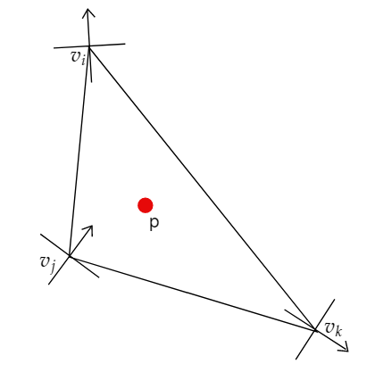

&emsp;&emsp;对于$$4-Rosy\ field$$，每个三角形网格的顶点$$V_i$$,都有一个标架$$q_{si}$$,根据以下式子，可判断奇异点：
$$
\begin{align}
&\mathop{\arg\min}_{si,sj}\{q_{si}\cdot q_{sj}\}\ \ \ \ \ \ \ \ \ \ \ \ si,sj\in [0,3]\\
& \mathrm{index}=(\sum(si-sj))\bmod 4
\end{align}
$$

$$
\left\{
\begin{aligned}
&\mathrm{is\ singularity},\ \ \ \ \ \ \mathrm{index}=1\ or\ 3\\
&\mathrm{not\ singularity},\ \ \ \mathrm{else}\\
\end{aligned}
\right.
$$

即在三角形中，相邻两个点的标架夹成的最小角的标架方向的序号的差的和与方向场的方向数的余数若为1或者3即该三角形内有奇异点。

