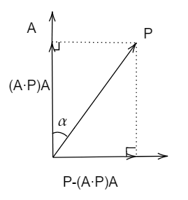

​		

# 介绍

&emsp;&emsp;先介绍二维旋转变换，然后由此推广到三维绕坐标轴旋转，再推广得到绕三维任意轴旋转的罗德里格斯旋转公式。

## 1.二维

&emsp;&emsp;如果要求$P$逆时针旋转$\theta$得到的$P^{'}$，记$Q$为$P$逆时针旋转90°后的向量,即$(-P_y,P_x)$,则$P$与$Q$正好组成了**该平面内的一组正交向量**，任何向量都可由其线性表出，由基本几何和三角学可得到：
$$
P^{'}=Pcos\theta+Qsin\theta
$$

则
$$
\begin{aligned}P_x^{'}&=P_xcos\theta-P_ysin\theta\\
P_{y}^{'}&=P_ysin\theta-P_xcos\theta\\
\end{aligned}
$$
写成矩阵为
$$
P^{'}=\begin{bmatrix}cos\theta&-sin\theta\\sin\theta&cos\theta\end{bmatrix}P
$$

## 2.三维绕坐标轴旋转

&emsp;&emsp;注意$R_y(\theta)$与其他不同是因为如果按照逆时针旋转，由$x\times z=-y$,则得到$y$轴负方向，因此需改为顺时针，即$-\theta$,这无论是在左手坐标系还是右手系都是相同的。

## 3. 三维绕任意轴旋转

**向量$P$绕任意轴$A$旋转$\theta$角度证明：**

&emsp;&emsp;不妨设$A$为单位向量，同时$P$可分解为与$A$平行和垂直的两个分量，分别为：
$$
\begin{align}
P_{projA}&=(A\cdot P)A=AA^TP\\
P_{perpA}&=P-(A\cdot P)A=P-AA^TP
\end{align}
$$
如图所示

故最终结果
$$
P^{'}=P_{perpA}^{'}+P_{ProjA}
$$
其中$$P_{PerpA}^{'}$$为$$P_{perpA}$$旋转$$\theta$$后得到的向量，如图

为求得其值，需找到一组线性组合来表示它，可选$$P_{perpA}$$与其旋转90°后的向量这两个向量作为组合，可以得知$$A\times P$$即为该向量，同时它的长度是与$$P_{perpA}$$相等的，这是因为
$$
|A\times P|=|P|sin\alpha=|P-(A\cdot P)A|
$$
所以
$$
P_{perpA}^{'}=[P-(A\cdot P)A]cos\theta+(A \times P)sin \theta
$$
所以
$$
\begin{align}
P^{'}&=[P-(A\cdot P)A]cos\theta+(A \times P)sin \theta+(A\cdot P)A\\
&=Pcos\theta+A\times P sin\theta+(A\cdot P)A(1-cos\theta)
\end{align}
$$
记$I$为单位阵，则矩阵形式为
$$
P^{'}=\{Icos\theta+\begin{bmatrix} 0&-A_z&A_y\\A_z&0&-A_x\\-A_y&A_x&0\end{bmatrix}sin\theta+AA^T(1-cos\theta)\}P
$$
其中记
$$
R=Icos\theta+\begin{bmatrix} 0&-A_z&A_y\\A_z&0&-A_x\\-A_y&A_x&0\end{bmatrix}sin\theta+AA^T(1-cos\theta)
$$
为罗德里格斯旋转公式，而将其展开写成一个矩阵就可得到旋转矩阵。