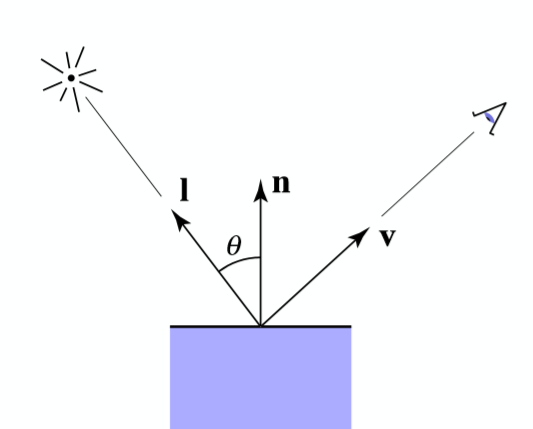
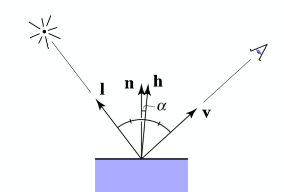
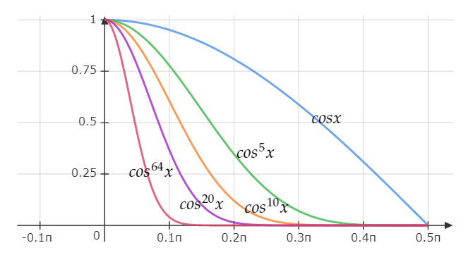
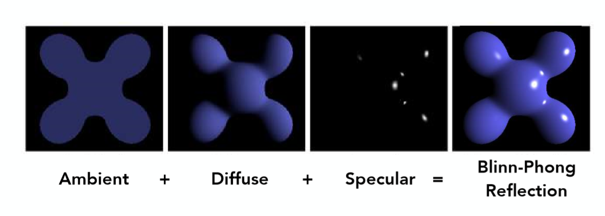

## 光照模型

$$
L=L_d+L_s+L_a
$$

$L_d$为漫反射光，$L_s$为高光，$L_a$为环境光。

###  1.漫反射

理解：漫反射散向四面八方，与观察方向无关，只与表面接受到的光源的**有效光**有关
$$
L_d=k_d\frac{I}{r^2}max\{0,n\cdot l\}
$$

$k_d$漫反射系数(范围0至1，表明反射的强度)，$I$光源,$r$表面距光源距离，$n$表明法向量，$l$入射光向量(注意方向为负)

ps:均为单位向量

###  2.高光

相比于Phong模型，Blinn-Phong模型的高光项采用$l,v$两者的角平分线与$n$的夹角来表示观察方向与镜面反射方向的夹角，从而提高计算效率。
$$
L_s=k_s\frac{I}{r^2}max\{0,n\cdot h\}^p
$$

$k_s$镜面反射系数(范围0至1，表明反射的强度)，$I$光源,$r$表面距光源距离，$n$表明法向量，$h=\frac{l+v}{|l+v|}$,$p$表示角度的影响，因为高光只在小角度才会起作用，下面是$cos^px$的几个变化图

###  3.环境光

在Blinn-Phong模型中环境光被当作常数处理
$$
L_a=k_aI_a
$$

### 4. 展示

