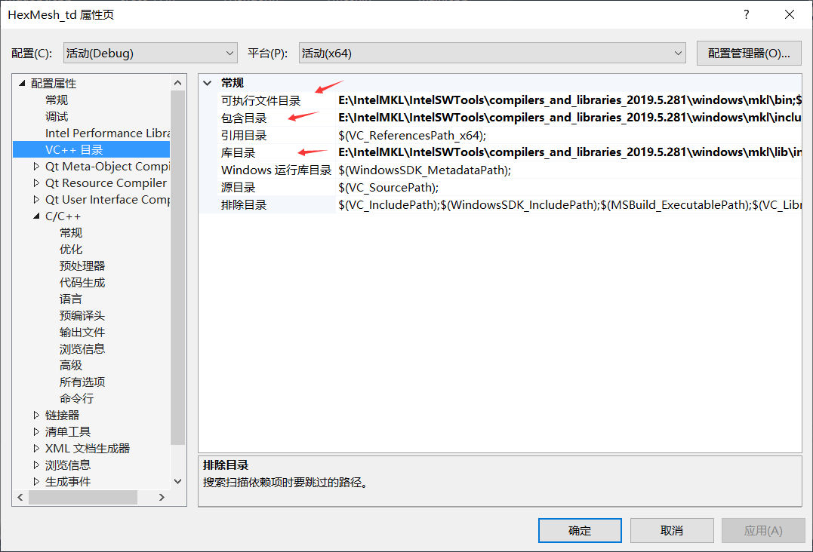
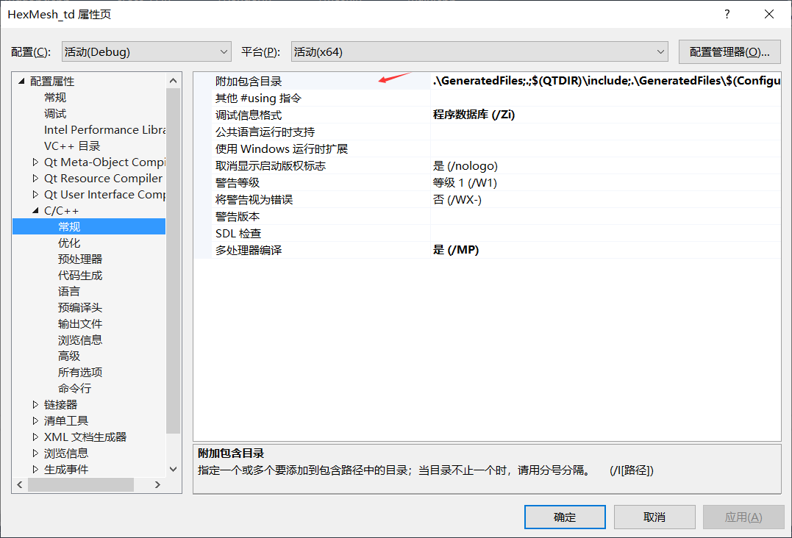
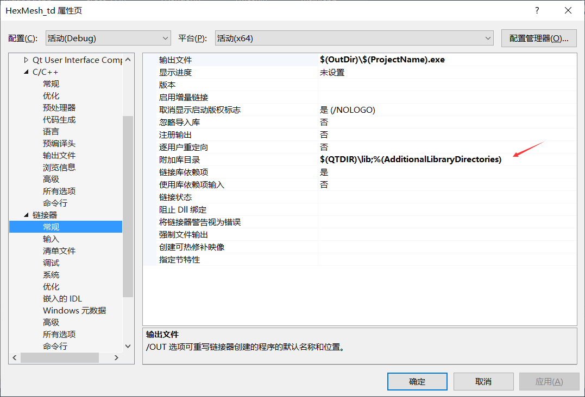
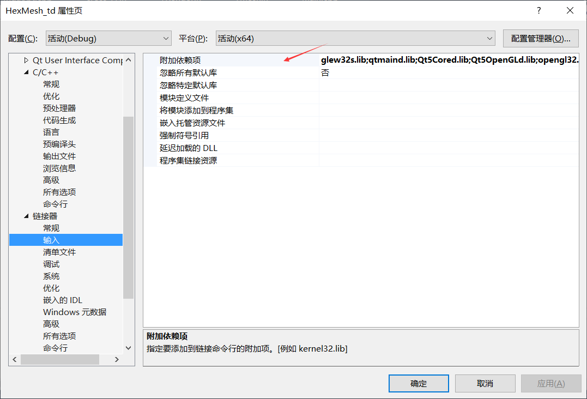

​		记录一下vs配置时项目的属性设置，主要是引入三方库时需要用到，不同于cmake这种通过配置文件来操作的，感觉vs这种通过鼠标来设置又蠢又麻烦。。。

- VC++目录：
  - 可执行目录：寻找依赖的可执行的文件的目录
  - 包含目录：寻找#include<xxxx.h>中的xxxx.h的搜索目录
  - 库目录：寻找.lib文件的搜索目录
- C/C++:
  - 常规->附加包含目录：寻找#include<xxxx.h>中的xxxx.h的搜索目录（每一项对应一个文件夹XXXX，文件夹中包含了编译时所需的头文件，使用时直接#include<XXXX>即可）

- 链接器：
  - 常规->附加库目录：寻找.lib文件的搜索目录
  - 输入->附加依赖项：lib库（C++的库会把函数、类的声明放在\*.h中，实现放在\*.cpp或\* .cc中。编译之后，\*.cpp，\*.cc，\*.c会被打包成一个.lib文件，这样可以保护源代码）

最终方法为:

1. 附加包含目录---添加工程的头文件目录：   项目->属性->配置属性->C/C++->常规->附加包含目录：加上头文件的存放目录； 
2. 附加库目录---添加文件引用的lib静态库路径：   项目->属性->配置属性->链接器->常规->附加库目录：加上lib文件的存放目录； 
3. 附加依赖项---添加工程引用的lib文件名：   项目->属性->配置属性->链接器->输入->附加依赖项：加上lib文件名。

​		**ps**:包含目录：修改了系统的include宏的值，是全局的； 附加包含目录：用于当前项目，对其他项目没有影响。

[更详细的文章](https://blog.csdn.net/raodotcong/article/details/8998379)

