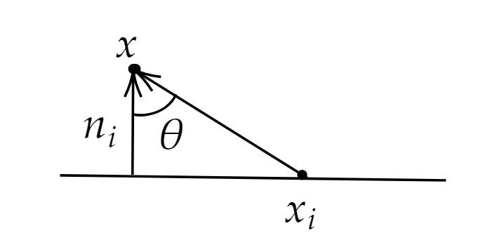
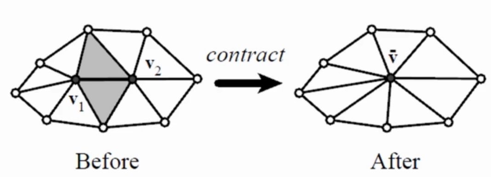

### 1.推导

&emsp;&emsp;(以下向量均为列向量)

&emsp;&emsp;设平面$p_i$的法向量为$n_i$,$x_i$为该平面上任一点，则其在齐次坐标下的方程为：
$$
\bar n_i=(n_i,-n_i \cdot x_i)
$$
设空间中任意一点$x$的齐次坐标为$\bar x=(x, 1)$

由几何关系可知$x$到$p_i$的距离的平方$d(x,p_i)$为：
$$
\begin{align}
d(x,p_i)&=((x-x_i)\cdot n_i)^2\\
&=(\begin{bmatrix}n_i,-n_i\cdot x_i\end{bmatrix}\begin{bmatrix}x\\1\end{bmatrix})^2\\
&=(\bar n_i^T\bar x)^2\\
&=\bar x^T(\bar n_i\bar n_i^T) \bar x\\
&=\bar x^TQ_i\bar x
\end{align}
$$

其中$Q_i$称为Quadratic error Matrix,注意到这个$Q_i$由于是法向量生成的，所以是定义面上的，现在分别定义顶点和边上的Quadratic error Matrix $Q_i^v$和$Q^e$:
$$
\begin{align}
Q_i^v&=\sum_{j\in \Omega(i)}Q_j\\
Q^e&=Q_1^v+Q_2^v
\end{align}
$$

所以每条边上的 $\bar v$要满足
$$
\bar v=min(v^TQ^ev)
$$
若$Q^e$可逆，记$\Delta=v^TQ^ev$,当取最小值时，应该满足$\frac{\partial \Delta}{\partial x}=0$，$\frac{\partial \Delta}{\partial y}=0$，$\frac{\partial \Delta}{\partial z}=0$，即：
$$
\left[\begin{array}{cccc}
q_{11} & q_{12} & q_{13} & q_{14} \\
q_{12} & q_{22} & q_{23} & q_{24} \\
q_{13} & q_{23} & q_{33} & q_{34} \\
0 & 0 & 0 & 1
\end{array}\right] \mathbf{\mathbf { \bar v }}=\left[\begin{array}{c}
0 \\
0 \\
0 \\
1
\end{array}\right]
$$
（ps:如果$Q^e$不满秩，则可取$\bar v=\frac{v_1+v_2}{2}$,即为两顶点中点）

### 2. 算法流程

&emsp;输入：网格，目标定点数n，cost阈值t

&emsp;输出：简化后的网格

1. 计算每条边的 $Q^e$

2. 计算每条边上的新的$\bar v$

3. while $$N_v$$ >n and $$Cost_{min}$$<t:   

   ​		将每条边的$cost=\bar v^TQ^e\bar v$放入最小堆；

   ​		删除堆顶的cost,并且塌陷该条边（即将该边的两个顶点并到$\bar v$上去，该新点上的Quadratic error Matrix则更新为刚才的$Q^e$）；

   ​		更新堆(更新相邻的$Q^e$和cost)；	

   end;

