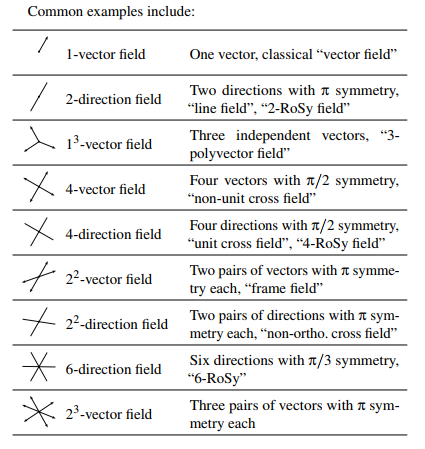

### 1. Types of Directional Fields

1. 方向场：每个点上的方向或矢量组成的一个大小为$$N$$的集合。
2. *RoSy fields*: *rotationally-symmetric direction fields*，对称角度为$$\frac{2\pi}{N}$$

以上右上角带小标的代表模大小相同。

### 2. Differential Geometry of Directional Fields

#### 2.1 Differential and Riemannian Structure

1. Tangent Bundle and Vector Fields：切丛和向量场，由曲面M的切向量组成。

2. Cotangent Bundle and 1-forms      ×

3. Connections and Parallel Transport   ×

4. Riemannian Metric   ×

5. Levi-Civita Connection    ×

6. Holonomy  ×

#### 2.2 Vector Field Topology

&emsp;&emsp;奇异点的指标，是包围奇异点的封闭曲线上的向量逆时针遍历一圈后所旋转的次数。而*Poincare–Hopf theorem*指出在向量场上所有奇异点指标之和$$\sum index =2-2g$$,其中$$g$$为规格

### 2.3 Vector Calculus  

1. 梯度、散度、旋度的介绍。
2. 霍奇分解和协变场 ×
3. 外积分

​		

