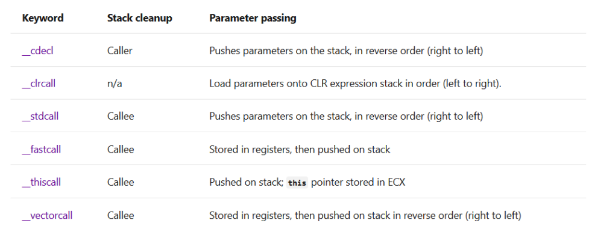

### 函数调用约定的常见问题

#### 1. 参数传递顺序

&emsp;&emsp;常用的有`__cdecl`:参数从右至左传递放在栈中，堆栈由调用者清除，支持可变长参数。（另外十分不建议在参数中包含了多个类似`a++`,`++a`,`a`，即同个参数的变换,十分容易引发问题）

​		对于c/c++函数参数的读取顺序(默认`__cedel`)，参数入栈时顺序的确是从右向左入栈，但是在入栈前会先把参数列表里的表达式从右向左算一遍得到表达式的结果，最后再把这些运算结果统一入栈。也就是说在参数入栈前，编译器会先把参数的表达式都处理掉，哪怕这些运算会改变其中某些参数的值；然后对于一般的操作来说，参数入栈时取值是直接从变量的内存地址里取的，但是对于a++操作，**编译器会开辟一个缓冲区来保存当前a的值**，然后再对a继续操作，**最后参数入栈时的取值是从缓冲区取，而不是直接从a的内存地址里取**。

因此，对于下面的程序：

```c++
a=10;
printf("%d %d %d\n",a++,++a,a,a++)
//output:12 13 13 10
```

&emsp;&emsp;首先从右向左处理表达式，最后a的结果变成13.但是在处理a++的时候，从最右边开始，第一个a++放进缓冲区的值为10，第二个a++放进缓冲区的值为12.因此最后处理结果如上。注意++a和a的值都是直接从a的内存中取出来的，都是13.


&emsp;&emsp;其中`__vectorcall`则用寄存器传浮点类型和向量(SIMD vector)类型的参数，可提高速度。

#### 2. 链接库的函数调用约定和名字修饰规则不匹配引起堆栈异常

​																																									----[参考文章链接](https://blog.csdn.net/guoliang624/article/details/7648823?utm_medium=distribute.pc_relevant.none-task-blog-BlogCommendFromMachineLearnPai2-2.channel_param&depth_1-utm_source=distribute.pc_relevant.none-task-blog-BlogCommendFromMachineLearnPai2-2.channel_param)

&emsp;&emsp;函数调用时如果出现**堆栈异常**，可能由于函数调用约定不匹配引起的。比如动态链接库a有以下导出函数：

```C++
long MakeFun(long lFun);
```

&emsp;&emsp;动态库生成的时候采用的函数调用约定是`__stdcall`,所以编译生成的a.dll中函数`MakeFun`的调用约定是`_stdcall`，也就是函数调用时参数从右向左入栈，函数返回时自己还原堆栈。现在某个程序模块b要引用a中的`MakeFun`，b和a一样使用  C++方式编译，只是b模块的函数调用方式是`__cdecl`，由于b包含了a提供的头文件中`MakeFun`函数声明，所以`MakeFun`在b模块中被其它调用`MakeFun`的函数认为是`__cdecl`调用方式，b模块中的这些函数在调用完`MakeFun`要恢复堆栈，可是`MakeFun`已经在结束时自己恢复了堆栈，b模块中的函数这样多此一举就引起了栈指针错误，从而引发堆栈异常。

&emsp;&emsp;宏观上的现象就是函数调用没有问题（因为参数传递顺序是一样的），`MakeFun`也完成了自己的功能，**只是函数返回后引发错误**。解决的方法也很简单，只要保证两个模块的在编译时设置相同的函数调用约定就行了。

&emsp;&emsp;在了解函数调用约定和函数的修饰规则之后，再来看在C++程序中使用C语言编译的库时经常出现的LNK  2001错误。还以上面例子的两个模块为例，这一次两个模块在编译的时候都采用`__stdcall`调用约定，但是a.dll使用C语言的语法编译的（C语言方式），所以a.dll的载入库a.lib中`MakeFun`函数的名字修饰就是`_MakeFun@4`。b包含了a提供的头文件中`MakeFun`函数声明，但是由于b采用的是C++语言编译，所以M`akeFun`在b模块中被按照C++的名字修饰规则命名为`?MakeFun@@YGJJ@Z`，编译过程相安无事，链接程序时c++的链接器就到a.lib中去找`?MakeFun@@YGJJ@Z`，但是a.lib中只有`_MakeFun@4`，没有`?MakeFun@@YGJJ@Z`，于是链接器就报告：

```markdown
error LNK2001: unresolved external symbol ?MakeFun@@YGJJ@Z
```

&emsp;&emsp;解决的方法和简单，就是要让b模块知道这个函数是C语言编译的，`extern "C"`可以做到这一点。一个采用C语言编译的库应该考虑到使用这个库的程序可能是C++程序（使用C++编译器），所以在设计头文件时应该注意这一点。通常应该这样声明头文件：

```c++
#ifdef _cplusplus
extern "C" {
#endif
    
long MakeFun(long lFun);     
#ifdef _cplusplus
}
#endif
```

​																																									