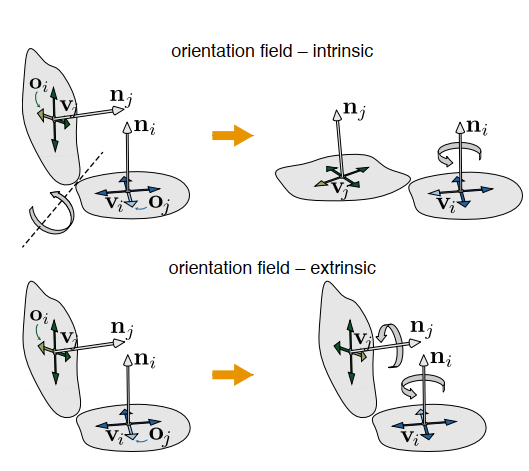
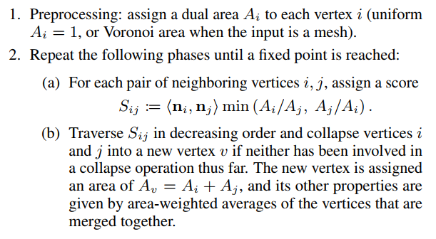

&emsp;&emsp;在顶点$$V_i$$定义n-Rosy标架场，定义
$$
\begin{align}&\mathcal{R_{s_o}}(\mathbf{o},\mathbf{n},k):=rot(\mathbf{n},k\frac{2\pi}{s_o}),k \in \mathbb{Z} \\&\mathcal{R_{s_o}}(\mathbf{o},\mathbf{n}):=\{\mathcal{R_{s_o}}(\mathbf{o},\mathbf{n},0),\mathcal{R_{s_o}}(\mathbf{o},\mathbf{n},1),\dots,\mathcal{R_{s_o}}(\mathbf{o},\mathbf{n},s_o-1)\}\end{align}
$$
第一个式子是将$$\vec{o}$$绕法向量$$\vec{n}$$旋转$$k\frac{2\pi}{s_o}$$角度，第二个式子即是在顶点处用$$\vec{o}$$对称旋转$$n$$次构成一个n-Rosy标架场

### 1.Intrinsic smoothness

&emsp;&emsp;该方法为将顶点$$V_i$$的相邻顶点$$V_j$$旋转到$$V_i$$的切平面上，然后寻找$$\vec{o_i}$$与$$\vec{o_j}$$的最小旋转角度，并用高斯赛德尔方法进行迭代求解。

&emsp;&emsp;定义能量函数：
$$
E(O, \mathbf{k}):=\sum_{i \in \mathcal{V}} \sum_{j \in \mathcal{N}(i)} \angle\left(\mathbf{o}_{i}, \mathcal{R}_{s_{o}}\left(\mathbf{o}_{j i}, \mathbf{n}_{i}, k_{i j}\right)\right)^{2}
$$
其中$$\mathbf{o}_{j i}:=\operatorname{rot}\left(\mathbf{n}_{j} \times \mathbf{n}_{i}, \angle\left(\mathbf{n}_{j}, \mathbf{n}_{i}\right)\right) \mathbf{o}_{j}$$,即$$o_j$$旋转到$$V_i$$切平面上后的向量。$$k_{ij}$$为旋转次数，要求解该能量函数，可通过以下方法
$$
\begin{align}
&k_{i j}:=\underset{0 \leq k<s_{o}}{\arg \min } \angle\left(\mathbf{o}_{i}, \mathcal{R}_{s_{o}}\left(\mathbf{o}_{j i}, \mathbf{n}_{i}, k\right)\right)\\
&\mathbf{o}_{i} \leftarrow \sum_{j \in \mathcal{N}(i)} w_{i j} \mathcal{R}_{s_{o}}\left(\mathbf{o}_{j i}, \mathbf{n}_{i}, k_{i j}\right), \quad \mathbf{o}_{i} \leftarrow \mathbf{o}_{i} /\left\|\mathbf{o}_{i}\right\|
\end{align}
$$
即先寻找最佳旋转次数，然后通过拉普拉斯权重归一化，由于搜寻空间是很小的($$s_o$$，如果是n-Rosy,也就是n,而n通常是很小的一个常数)，可用暴力方法，若顶点$$V_i$$周围有$$m$$个点，那迭代一次的搜索空间大小也只有$$mn$$

然后通过高斯赛德尔迭代：
$$
\begin{array}{ll}
\mathbf{o}_{i}^{\prime} \leftarrow w_{i j_{1}} \mathcal{R}_{s_{o}}\left(\mathbf{o}_{j_{1} i}, \mathbf{n}_{i}, k_{i j_{1}}\right), & \mathbf{o}_{i} \leftarrow \mathbf{o}_{i}^{\prime} /\left\|\mathbf{o}_{i}^{\prime}\right\| \\
\mathbf{o}_{i}^{\prime} \leftarrow \mathbf{o}_{i}^{\prime}+w_{i j_{2}} \mathcal{R}_{s_{o}}\left(\mathbf{o}_{j_{2} i}, \mathbf{n}_{i}, k_{i j_{2}}\right), & \mathbf{o}_{i} \leftarrow \mathbf{o}_{i}^{\prime} /\left\|\mathbf{o}_{i}^{\prime}\right\|
\end{array}
$$

### 2.Extrinsic smoothness

&emsp;&emsp;该方法区别于上面的方法为直接在三维空间里求解能量函数，即不再旋转到切平面，则能量函数改为：
$$
E_{\mathrm{e}}(O, k):=\sum_{i \in \mathcal{V}} \sum_{j \in \mathcal{N}(i)} \angle\left(\mathcal{R}_{s_{o}}\left(\mathbf{o}_{i}, \mathbf{n}_{i}, k_{i j}\right), \mathcal{R}_{s_{o}}\left(\mathbf{o}_{j}, \mathbf{n}_{j}, k_{j i}\right)\right)^{2}
$$
则$$k_{ij}$$的最优解为
$$
\left(k_{i j}, k_{j i}\right):=\underset{0 \leq k, l<s_{o}}{\arg \min } \angle\left(\mathcal{R}_{s_{o}}\left(\mathbf{o}_{i}, \mathbf{n}_{i}, k\right), \mathcal{R}_{s_{o}}\left(\mathbf{o}_{j}, \mathbf{n}_{j}, l\right)\right)^{2}
$$
可以看到搜索空间变为$$n^2$$,其实它还是很小的，也是可以暴力求的。下一步则依然还是高斯赛德尔迭代。

### 3.说明

1. 上述算法有解的条件是收敛，而事实就是它就是**收敛**的。
2. 上述算法因为它是基于局部的，所以可以**支持并行**。
3. 初始标架场被设置为随机的切向量，锐利特征则通过二面角阈值来判断，锐利边上顶点的法向量为任一面的法向量，而其余的可用角度权重等来定义。
4. Gauss–Seidel method可能陷入局部最小解，可通过随机法避免，而该文提出了另一种**多分辨率层次法（Multiresolution hierarchy）**来避免这种情况,如下。
  