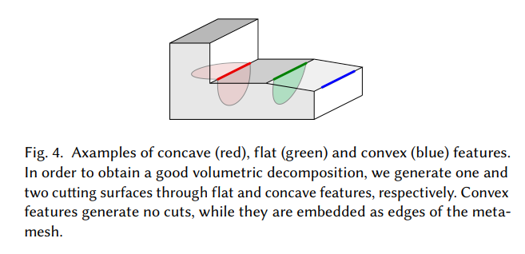
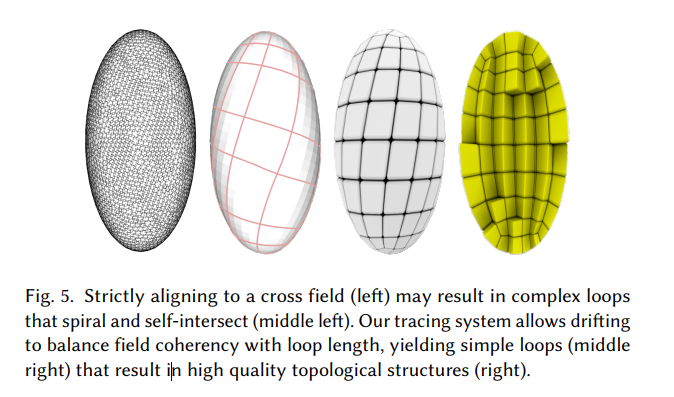
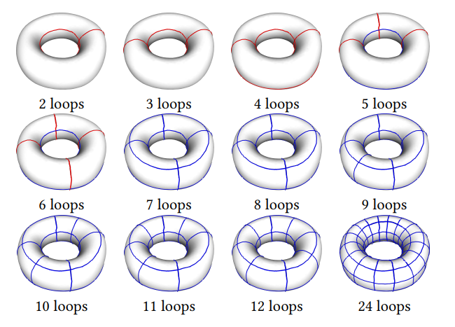
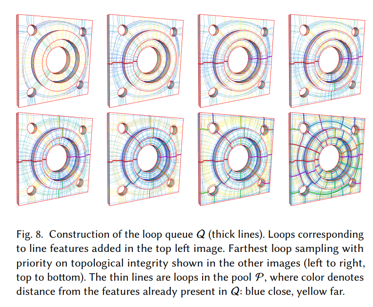
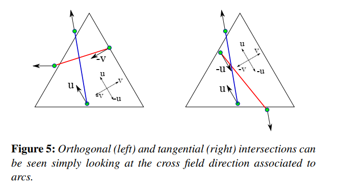

### 1.基本概念

&emsp;&emsp;feature line分为flat、concave、convex三种，由integrated curvature的$$\theta$$根据阈值$$\bar \theta$$判定:
$$
\left\{
\begin{aligned}
&\mathrm{flat},\ \ \ \ \ \ \ \ \ \ \ |\theta|<\bar\theta \\
&\mathrm{concave},\ \ \ \ \theta<-\bar\theta\\
&\mathrm{convex},\ \ \ \ \ \ \theta>\bar\theta\\
\end{aligned}
\right.
$$
这里$$\bar \theta=10^{\circ}$$，例子如下图

&emsp;&emsp;标架场采用《Mixed-integer quadrangulation》中的方法建立

### 2.Field-Coherent Loops

&emsp;&emsp;由标架场引导出field-coherent geodesic path:$$\ell$$切线与p点标架夹角小于$$\frac{\pi}{4}$$。为了描述其偏离程度使用以下公式
$$
\|w\|_{\mathrm{X}}=|w|\left(1+\alpha \frac{\angle\left(p_{\theta}, w\right)}{\pi / 4}\right)
$$
其中$$w$$为切向量，$$p_{\theta}$$为标架之一，$$\alpha$$为惩罚系数。我们的目标是由点沿着field-coherent geodesic path返回点，即得到闭合曲线。而上述公式是为了避免造成过度偏离现象，如下图

&emsp;&emsp;定义曲线之间的距离如下：
$$
d\left(\ell_{i}, \ell_{j}\right)=\frac{1}{\left|\ell_{j}\right|} \int_{\ell_{j}} \operatorname{dist}\left(\ell_{i}, p_{\theta}\right) d p_{\theta}
$$
其中$$\operatorname{dist}\left(\ell_{i}, p_{\theta}\right)$$为$$p_{\theta}$$与$$\ell$$之间的最短field-coherent geodesic path长度。

&emsp;&emsp;设loop集合$$\mathcal{L}=\{\ell_1 \dots \ell_k \}$$,而$$\ell \notin \mathcal{L} $$，	
$$
d(\mathcal{L}, \ell)=\frac{1}{|\ell|} \int_{\ell} \min _{\ell_{i} \in \mathcal{L}} \operatorname{dist}\left(\ell_{i}, p_{\theta}\right) d p_{\theta}
$$
则离$$\mathcal{L}$$最远的$$\bar \ell$$为
$$
\bar{\ell}=\operatorname{argmax}_{\ell \in \mathrm{L}} d(\mathcal{L}, \ell)
$$

### 3.特征loop

&emsp;&emsp;维护一个初始队列$$Q$$用来装loop,feature line $$\ell$$ 分为两类处理，如下：

1. 闭合：如果为flat特征则加入$$Q$$队列;如果为concave,拷贝正反方向两份入队
2. 非闭合：如果为flat拓展成一个loop入队，如果为concave,沿两端点分别生成两个loop入队

### 4.采样最远loop

&emsp;&emsp;每次采样最远的loop加入$$Q$$中，其终止条件需满足以下两个：

1. Topological integrity ：Q中每个loop至少与其他loop相交三次。
2. Geometric fit  ：path的面积与polyon的面积相差不超过阈值

### 5. 维护采样池

&emsp;&emsp;定义$$\bar Q=Q \cup C\mathcal{F}$$,其中$$C\mathcal{F}$$为convex feature,通过以下两种方式创建采样池$$\mathcal{P}$$:

1. 以固定间隔采样$$\bar Q$$中loop,对其中每个loop，跟踪一个垂直它自己新loop加入采样池$$\mathcal{P}$$，新loop需满足与$$\bar Q$$中loop不正切相交
2. 在表面进行泊松分布采样（Poisson-Disk Sampling）获得点集$$\mathrm{P}$$,对于每个$$p\in \mathrm{P}$$跟踪两条新的loop,同样的他们需要满足与$$\bar Q$$中的不正切相交，加入采样池$$\mathcal{P}$$

每当从$$\mathcal{P}$$中选择一条最远loop加入$$Q$$中后，需要对采样池$$\mathcal{P}$$用方法1重新装填新的loop进去。

&emsp;&emsp;为提高Topological integrity，从采样池中选取loop不再是简单的选择与$$\bar Q$$中最远的loop,而使用新的规则：设$$\hat Q$$为$$Q$$的子集且不满足Topological integrity条件，我们使采样池$$\mathcal{P}$$中与$$\hat Q$$中相交的loop具有更大的优先度被选择，即除了距离因素外加入相交次数作为优先度来快速提高拓扑完整性。根据以上规则在采样池中选择与$$\bar Q$$最远的loop$$\ell$$ 加入$$Q$$,然后在采样池$$\mathcal{P}$$中移除所有与$$\ell$$正切相交的loop,并重新跟踪它们的源点$$p \in \mathrm{P}$$的两条正交loop(满足与新更新的$$\bar Q$$中的loop不正切相交)

### 6. 输出

&emsp;&emsp;输出由两部分组成：队列$$Q$$与凸特征$$C\mathcal{F}$$。其中每个loop都以$$((p_1,n_1)\dots(p_h,n_h))$$形式给出，$$p$$为点，$$n$$为法向量。

&emsp;&emsp;需要注意不是每个非闭合的feature都可以拓展成闭合loop，在拓展feature loop时也可能产生自相交的loop(这种类型舍弃)，而那些无法闭合的feature我们把它们称为incomplete loop并加入$$Q$$，在下一个阶段进行处理。

### 附1.Tracing loops

&emsp;&emsp;trace loop使用《Tracing Field-Coherent Quad Layouts 》的方法在一个拓展出来的图$$\mathcal{G}$$上进行Dijkstra 算法，其中图$$\mathcal{G}$$由曲面M上的边和顶点，还有边上的采样得到斯坦纳点（Steiner point）和连接斯坦纳点和顶点的边组成。不同的是，这里的

&emsp;&emsp;距离测量：对于集合$$\mathcal{L}$$中的每条loop,在每条loop上的每个点作为源点跑Dijkstra,从而找到最远的$$\ell \notin \mathcal{L}$$（这里很耗时）

&emsp;&emsp;传播限制：在做Dijkstra时，搜索路径不能与$$\bar Q$$正切相交

### 附2.相交说明

1. 正切相交判断：曲线相交，标架平行
2. 垂直相交判断：曲线相交，标架相交

