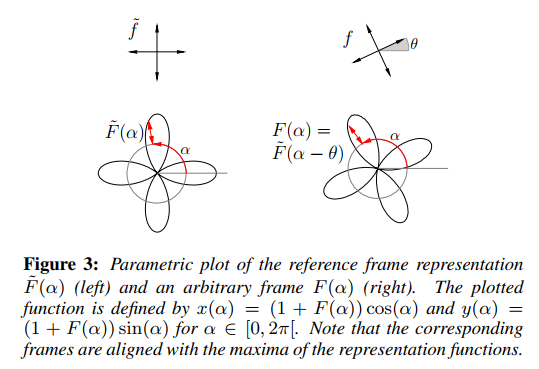

&emsp;&emsp;该论文以基函数来描述标架，首先说明了该方法在2D下的可行性，然后拓展到3D形式。3D形式延续《Boundary aligned smooth 3D cross-frame field》中使用球谐函数作为基函数，不同的是该文使用了不同的多项式$$x^4+y^4+z^4$$来在球上展开，并重新定义了目标函数，优化了求解，速度和质量都得到提升。

### 一、 2D

#### 1.定义

&emsp;&emsp;该文采用基函数来表示标架：
$$
\begin{gather}
let \quad \tilde{F}(\alpha)=cos(4\alpha)\quad \alpha \in[0,2\pi]\\
\therefore  F(\alpha)=\tilde{F}(\alpha-\theta)=cos(4\alpha-4\theta)=cos(4\theta)cos(4\alpha)+sin(4\theta)sin(4\alpha)
 \\
let\quad B=(cos(4\alpha),sin(4\alpha)),a=(cos(4\theta),sin(4\theta))^{\top}\\
\therefore F=Ba
\end{gather}
$$
即用$$\tilde F$$表示参考标架函数，$$F$$表示旋转$$\theta$$后的标架函数，下图是说明。

#### 2. 能量函数

&emsp;&emsp;定义能量函数如下：
$$
\begin{aligned}
E &=\sum_{i j} \int_{0}^{2 \pi}\left(F^{j}(\alpha)-F^{i}(\alpha)\right)^{2}d\alpha \\
&=\sum_{i j} \int_{0}^{2 \pi}\left(B a^{j}-B a^{i}\right)^{2}d\alpha\\
&=\sum_{i j}\left(a^{j}-a^{i}\right)^{\top}\left(\int_{0}^{2 \pi} B^{\top} B d \alpha\right)\left(a^{j}-a^{i}\right) \\
&=\pi \sum_{i j}\left\|a^{j}-a^{i}\right\|^{2}
\end{aligned}
$$
ps:最后一步可以化简是因为$$B$$是正交的，且模长为$$\sqrt{\pi}$$。

#### 3. 矩阵化

&emsp;&emsp;定义边界或限制条件如下,
$$
a_{0}^{i}=\cos \left(4 \theta^{i}\right) ; \quad a_{1}^{i}=\sin \left(4 \theta^{i}\right)
$$
即$$\theta^i$$是指定标架的方向，如为边界，即为法向方向。

&emsp;&emsp;将$$E$$转换成$$||AX-b||^2$$形式，其中$$X_{2i}=a_{0}^{i}，X_{2i+1}=a_{1}^{i}$$，所以$$X$$是$$2n$$维向量，$$n$$为顶点数，定义初始条件如下，
$$
\begin{aligned}
\sqrt{\pi}\left(X_{2 i}-X_{2 j}\right) &=0 \\
\sqrt{\pi}\left(X_{2 i+1}-X_{2 j+1}\right) &=0
\end{aligned}
$$
即相邻点相等。

&emsp;&emsp;边界条件设置如下，
$$
\begin{aligned}
C X_{2 i} &=C \cos 4 \theta^{i} \\
C X_{2 i+1} &=C \sin 4 \theta^{i}
\end{aligned}
$$
其中$$C=100$$,为常数（经验得来）。

&emsp;&emsp;其中$$b=\mathbf{0}$$,$$2\mathcal{E}\times2n$$矩阵$$A$$如下($$\mathcal{E}$$为边),下标是行，上标是列
$$
A=\left\{\begin{aligned}&a_{\mathcal{E}_{ij}}^{2i}=a_{\mathcal{E}_{ij}}^{2i+1}=1,a_{\mathcal{E}_{ij}+1}^{2j}=a_{\mathcal{E}_{ij}+1}^{2j+1}=-1\ \ \ &&edge(v_i,v_j)\in \mathcal{E}\\&0  &&other\end{aligned}\right.
$$

最小二乘方程的解等价于$$A^{\top} AX=A^{\top}b$$

&emsp;&emsp;解出该最小二乘方程后，可得到解并标准化：
$$
a^{i} \leftarrow\left(X_{2 i}, X_{2 i+1}\right)^{\top} /\left\|\left(X_{2 i}, X_{2 i+1}\right)\right\|
$$
