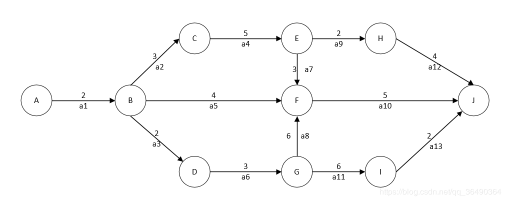

## AOE网
**1.介绍**
定义：在带权有向图中，以顶点表示事件，有向边表示活动，边上的权值表示完成该活动的开销，则称这种有向图为用边表示活动的网络，简称为AOE网（Activity On Edge Network）

性质：

 - 只有在某顶点所代表的事件发生后，从该顶点出发的各有向边所代表的活动才能开始
 - 只有在进入某一顶点的各有向边所代表的活动都已经结束时，该顶点所代表的事件才发生

**2.几个词的解释**
ps:事件是点，活动是边！！！

关键路径：
从源点到汇点的所有路径中，具有最长路径长度的路径，该路径上的活动成为`关键活动（后面有用先记着）`

事件`V[k]`的最早发生时间`ve[k]`:
从开始顶点V到V[k]的最长路径长度。

事件`V[k]`的最迟发生时间`vl[k]`:
不推迟整个工程完成的前提下，即保证它所指向的事件Vi在ve(i)时刻能够发生时，改事件最迟必须发生的事件。

活动`a[i]`的最早开始时间`e[i]`:       活动a[i]用边`(V[k],V[j])`表示

```c++
e[i]=ve[k]
```

活动`a[i]`的最迟开始时间`l[i]`:

```c++
l[i]=vl[j]-Weight(V[k],V[j])
```

一个活动a[i]的松弛时间：
`d[i]=l[i]-e[i]`或者`d[i]=关键路径长度-包含a[i]活动的最长路径`

**3.计算**


**3.1 计算事件的最早和最迟发生时间**

ve的计算方法为从前往后计算，取最大值，例如对于F,`ve(F)=max{ve(B)+a5,ve(E)+a7,ve(G)+a8}` ,只有一个的话就只取一个，多个的话，多个中取最大值

vl的计算方法为从后往前计算，首先另终点J的vl值为其ve，即vl(J)=ve(J)=18，然后多个中取最小值，例如对于B,`vl(B)=min{vl(C)-a2,vl(F)-a5,vl(D)-a3}=2`;若只有一个，例如对于H,`vl(H)=vl(J)-a12=14`

最终算出各个顶点的最早和最迟发生时间如下
|V|ve（事件最早发生时间）| vl（事件最迟发生事件）|
|--|--|--|
|  A| 0 |0|
|  B| 2 |2|
| C| 5 |5|
|  D|  4|4|
| E| 10 |10|
|  F|13 |13|
| G| 7 |7|
|  H| 12 |14|
|  I| 13 |16|
|  J|18  |18|

有以上可以得出ve==vl的点即为关键路径上的事件，即A,B,C,D,E,F,G,J，则有以上点连接的边所代表的活动a1,a2,a3,a4,a6,a7,a8,a10疑似为关键活动
注意：
关键路径可能不只有一条，计算到这里只能得出关键路径上的事件，具体怎么走还等计算活动的最早和最迟开始时间，如果仅仅需要计算出关键路径，则只需计算几个疑似关键活动的最早和最迟发生时间，为了清楚，我们这里就把全部活动的都计算出来


**3.2活动的最早和最迟开始时间**
活动最早开始时间：  例如a1,为边（A,B），则`a1=ve(A)=0`;例如a2,为边（B,C），则a2=ve(B)=2

活动最晚开始时间：例如对于a1,为边（A,B）,则`a1=vl(B)-weight(a1)=2-2=0`；例如a12,为边（H,J）,则`a12=vl(J)-weight(a12)=18-4=14`

最终结果如下

|a|e（活动最早开始时间）| l（活动最迟开始事件）|
|--|--|--|
|  a1| 0 |0|
|  a2| 2 |2|
| a3| 2 |2|
|  a4|  5|5|
| a5 |2|9|
|  a6|4 |4|
| a7| 10|10|
|  a8| 7 |7|
|  a9| 10 |12|
|  a10|13 |13|
|  a11| 7 |10|
|  a12| 12 |14|
|  a13|13  |16|

找出e==l的活动ai,这里为a1,a2,a3,,a4,a6,a7,a8,a10;经观察可发现这里有两条关键路径，分别为a1,a2,a4,a7,a10和a1,a3,a6,a8,a10


又比如问一个活动的松弛时间，即活动ai在不拖延总工程时间的情况下，该活动可以拖延的时间，有两种解法，比如问BF的松弛时间：
解1：BF=a5,所以松弛时间=l(a5)-e(a5)=7
解2：包含BF活动的最长路径为ABFJ,其长度为11，又因为关键路径长度为18，所以松弛时间为18-11=7