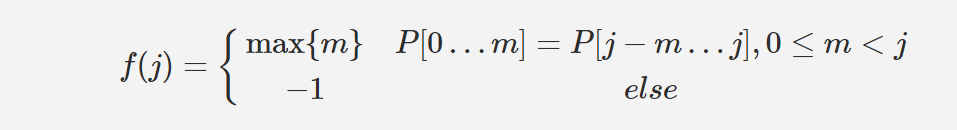
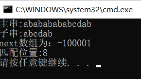

## KMP算法
详解找来找去感觉还是这两篇解释的很好
[KMP算法（1）：如何理解KMP](https://segmentfault.com/a/1190000008575379?utm_medium=referral&utm_source=tuicool)
[KMP算法（2）：其细微之处](https://segmentfault.com/a/1190000009409706)


## **笔记**


next[i]=j,即模式串p[1-i]的最长的相同真前后缀的长度
```c++
#include "stdafx.h"
#include "string"
#include "iostream"
using namespace std;
void getNext(string p, int next[])
{
	int len = p.size();
	int i = 0;
	int j = -1;
	next[0] = -1;
	while (i < len - 1)
	{
		if (j == -1 || p[i] == p[j])
			next[++i] = ++j;
		else
			j = next[j];
	}
}
int KMP(string s, string p, int next[])
{
	int i, j;
	int pl = p.size();
	int sl = s.size();
	for (i = 0, j = 0; i < sl&& j < pl;)//注意这里不要用j<p.size() 因为p.size()是unsigned int 类型，然后j有可能变成-1然后直接跳出循环
	{
		if (j == -1 || s[i] == p[j])
		{
			i++;
			j++;
		}
		else
			j = next[j];
	}
	if (j == p.size())
		return i - j;
	return -1;
}

int main()
{
	int next[100] = { 0 };
	string s = "abababababcdab";
	string p = "abcdab";
	cout << "主串:" << s << endl;
	cout << "子串:" << p << endl;

	getNext(p, next);
	cout << "next数组为：";
	for (int i = 0; i < p.size(); i++)
		cout << next[i];
	cout << endl;

	cout << "匹配位置:" << KMP(s, p, next) << endl;
	return 0;
}
```

## 结果




## 手工求解next数组方法

以下两种方法互通，分别为以0为初始或以-1为初始


**1.以0为初始**

 i|0| 1    | 2    | 3    | 4    | 5    | 6    | 7    | 8    | 9    | 10
 -- | -- | -- | -- | -- | -- | -- | -- | -- |-- | -- | -- 
 p    | a    | b    | a    | b    | a    | a    | a    | b    | a    | b    | a 
 next | 0    | 1    |      |      |      |      |      |      |      |      |

 1. 当i=0，1 next[0],next[1]分别初始为0，1
 2. 当i=2,p的前2位为 `ab`,因`next[1]=1`，则观察`ab`的前`1`位和后`1`位是否相同，不同，所以`next[2]=1`(记住后面运算时若连1位相同都没有则记为`1`，即最小记为1，其实看后面就知道意思是`next[i]=0+1=1`)
 3. 当i=3,p的前3位为`aba`,因`next[2]=1`,则观察`aba`的前`1`位和后`1`位是否相同，相同，则在原基础上`+1`，即`next[3]=1+1=2`
 4. 当i=4,p的前4位为`abab`,因`next[3]=2`,则观察`abab`的前`2`位和后`2`位是否相同，相同，则在原基础上`+1`，即`next[4]=2+1=3`
 5. 当i=5,p的前5位为`ababa`,因`next[4]=3`,则观察`ababa`的前`3`位和后`3`位是否相同，相同，则在原基础上`+1`，即`next[5]=3+1=4`
 6. 当i=6,p的前6位为`ababaa`,因`next[5]=4`,则观察`ababaa`的前`4`位和后`4`位是否相同，不相同，则在原基础上`-1`，观察前`3`位和后`3`位是否相同，不同继续`-1`，直到观察到前`2`位和后`2`位相同，若不同再继续减，后观察到前1位和后1位相同，则next[6]=1+1=2
 7.  当i=7,p的前7位为`ababaaa`,因`next[5]=2`,则观察`ababaaa`的前`2`位和后`2`位是否相同，不相同，则在原基础上`-1`，观察前`1`位和后`1`位是否相同，相同，则next[7]=1+1=2
 8. ...
 9. ...
 10. ...   

最终为

| i    | 0    | 1    | 2    | 3    | 4    | 5    | 6    | 7    | 8    | 9    | 10   |
| ---- | ---- | ---- | ---- | ---- | ---- | ---- | ---- | ---- | ---- | ---- | ---- |
| p    | a    | b    | a    | b    | a    | a    | a    | b    | a    | b    | a    |
| next | 0    | 1    | 1    | 2    | 3    | 4    | 2    | 2    | 3    | 4    | 5    |

**2.以-1为初始**

| i    | 0    | 1    | 2    | 3    | 4    | 5    | 6    | 7    | 8    | 9    | 10   |
| ---- | ---- | ---- | ---- | ---- | ---- | ---- | ---- | ---- | ---- | ---- | ---- |
| p    | a    | b    | a    | b    | a    | a    | a    | b    | a    | b    | a    |
| next | -1   | 0    |      |      |      |      |      |      |      |      |      ||

 1. 当i=0，1 next[0],next[1]分别初始为-1，0
 2. 当i=2，p的前2位为`ab`,因`next[1]=0`，则`next[1]+1=1`,观察前`1`位和后`1`位是否相同，不同，则`1-1=0`，到0为止，则`next[2]=0`（`1-1=0`中第一个1的意思即前1位和后1位是否相同中的1）
 3. 当i=3,p的前3位为`aba`,因`next[2]=0`,则`next[2]+1=1`,则观察的前`1`位和后`1`位是否相同，相同，则`next[3]=1`
 4. 当i=4,p的前4位为`abab`,因`next[3]=1`,则`next[3]+1=2`,则观察前`2`位和后`2`位是否相同，相同，则`next[4]=2`
 5.  当i=5,p的前5位为`ababa`,因`next[4]=2`,则`next[4]+1=3`,则观察前`3`位和后`3`位是否相同，相同，则`next[4]=3`
 6. 当i=6,p的前6位为`ababaa`,因`next[5]=3`,则`next[5]+1=4`,则观察前`4`位和后`4`位是否相同，不相同;则观察前`3`位和后`3`位是否相同，不同;则观察前`2`位和后`2`位是否相同，不相同;则观察前`1`位和后`1`位是否相同，相同，则`next[6]=1`
 7. 当i=7,p的前6位为`ababaaa`,因`next[6]=1`,则`next[6]+1=2`,则观察前`2`位和后`2`位是否相同，不相同;则观察前`1`位和后`1`位是否相同，相同，则`next[7]=1`
 8. ...
 9. ...
 10. ...

 最终为


| i    | 0    | 1    | 2    | 3    | 4    | 5    | 6    | 7    | 8    | 9    | 10   |
| ---- | ---- | ---- | ---- | ---- | ---- | ---- | ---- | ---- | ---- | ---- | ---- |
| p    | a    | b    | a    | b    | a    | a    | a    | b    | a    | b    | a    |
| next | -1   | 0    | 0    | 1    | 2    | 3    | 1    | 1    | 2    | 3    | 4    |


**俩种方法的关系**
观察发现法1的next数组每项+1就是法2的next数组，所以考试时无论用哪一种都是可以的，只要`分析或者看清`是以什么为初值就行
其实还可以理解为把法1的next数组向右移1位，并把首位赋值位-1