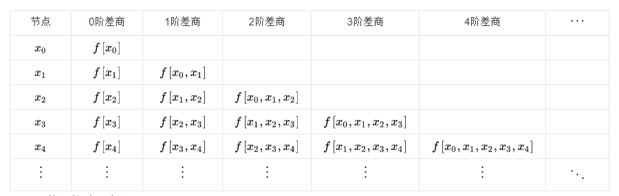

## Lagrange插值法

​		考虑有$n$个**不同的点**$(x_1,y_1)$,$(x_2,y_2)$,$(x_i,y_i)$$\dots (x_n,y_n)$,定义函数$f_i(x)$满足在$l_i(x_j)$满足克罗内克符号函数$\delta_{ij}$，
$$
l_i(x_j)=\delta_{ij}=\begin{cases}
1\quad\quad\quad i=j\\
0\quad\quad\quad i\not=j
\end{cases}l
$$
此时，若另
$$
L(x)=\sum_{i=1}^n y_il_i(x)
$$
则对于任意$x_i$有
$$
y_i=l_i(x_i)
$$
即$n$个点必然经过$L(x)$,即为所求。

​		再考虑$l_i(x)$,其应为一个**$n-1$次多项式**,则可由因式法写出满足要求的函数:
$$
\begin{align}
l_i(x)&=\frac{(x-x_1)(x-x_2)(x-x_3)\dots(x-x_{i-1})(x-x_{i+1})\dots(x_i-x_n)}{(x_i-x_1)(x_i-x_2)(x_i-x_3)\dots(x_i-x_{i-1})(x_i-x_{i+1})\dots(x_i-x_n)}\\
\\
&=\prod_{j\not=i\\j=1}^{ n }\frac{x-x_j}{x_i-x_j}
\end{align}
$$
这里的$l_i(x)$称为插值基函数。

​		以下是代码实现

```c++
#include<stdio.h>
#include<stdlib.h>
float x[7] = {1.20, 1.24, 1.28, 1.32, 1.36, 1.40};
float y1[7] = {1.09545, 1.11355, 1.13137,1.14891, 1.16619, 1.18322};
float y2[7] = {0.07918, 0.09342, 0.10721, 0.12057, 0.13354, 0.14613};
float xi[6] = {1.22, 1.26, 1.30, 1.34, 1.38};

float Lagrange(float *y,float cx)
{
    int n=6;
    float temp[10],ans=0;
    for(int i=0;i<n;i++)
    {
        temp[i] = y[i];
        for(int j=0;j<n;j++)
        if(j!=i)
            temp[i] *= (cx - x[j]) / (x[i] - x[j]);
        ans += temp[i];
    }
    return ans;
}

int main()
{
    for (int i = 0; i < 5;i++)
        printf("当x=%.2f,y1=%.5f,y2=%.5f\n", xi[i], Lagrange(y1,xi[i]),Lagrange(y2,xi[i]));
    system("pause");
    return 0;
}
```

​		我们可以发现假如新加入一个点,就必须得重新计算,这是它的缺点.


## Newton插值法

​		该方法确定了一组新的基函数,确保能加入新的点能够重用之前的计算结果:
$$
\begin{aligned}
\phi_{1}(x) &=1 \\
\phi_{2}(x) &=\left(x-x_{1}\right) \\
\phi_{3}(x) &=\left(x-x_{1}\right)\left(x-x_{2}\right) \\
\cdots &=\cdots \\
\phi_{n+1}(x) &=\prod_{i=1}^{n}\left(x-x_{i}\right)
\end{aligned}
$$
可以看到由于$\phi_{n+1}(x)=\phi_{n}(x)(x-x_{n})$,因此可以重用之前的结果。

则最终的多项式为:
$$
N(x)=\sum_{i=1}^{n+1}a_i\phi_i(x)
$$
现在仅仅需要确定$a_i$的值就可以确定$N(x)$。

​		我们将每个点依次带入相减可得到一个神奇的规律：
$$
\begin{aligned}
a_1&=y_1\\
a_2&=\frac{y_2-y_1}{x_2-x_1}\\
a_3&=\frac{\frac{y_3-y_2}{x_3-x_2}-\frac{y_2-y_1}{x_2-x_1}}{x_3-x_1}\\
\vdots
\end{aligned}
$$
我们把这种叫做**差商**,0阶均差定义为$f[x_i]=f(x_i)$,$n-1$阶差商为：


$$
f[x_1,x_2,x_3\dots x_n]=\frac{f[x_1,x_2,x_3\dots x_{n-1}]-f[x_2,x_3,x_4\dots x_n]}{x_n-x_1}
$$
下面是差商表



所以最终为
$$
\begin{aligned}
N(x)=& f\left(x_{1}\right)+\\
& f\left[x_{1}, x_{2}\right]\left(x-x_{1}\right)+\\
& f\left[x_{1}, x_{2}, x_{3}\right]\left(x-x_{1}\right)\left(x-x_{2}\right)+\\
& f\left[x_{1}, \ldots, x_{4}\right]\left(x-x_{1}\right)\left(x-x_{2}\right)\left(x-x_{3}\right)+\\
& \ldots
\end{aligned}
$$

以下是代码

```c++

```


## 两者关系

​		其实我们可以发现两个方法都是通过$n$个点确定了一组$n$个方程的方程组:
$$
\begin{cases}
y_1&=a_0+a_1x_1+a_2x_1^2+\dots+a_nx_1^n\\
y_2&=a_0+a_1x_2+a_2x_2^2+\dots+a_nx_2^n\\
\vdots\\
y_n&=a_0+a_1x_n+a_2x_n^2+\dots+a_nx_n^n\\
\end{cases}
$$
矩阵形式为$Y=XA$
$$
\begin{bmatrix} y_1\\y_2\\ \vdots \\y_n\end{bmatrix}=
\begin{bmatrix} 1&x_1&x_1^2&\dots&x_1^n\\1&x_2&x_2^2&\dots&x_2^n\\ \vdots&\vdots&\vdots&\dots&\vdots\\1&x_n&x_n^2&\dots&x_n^n\end{bmatrix}
\begin{bmatrix} a_0\\a_1\\ \vdots \\a_n\end{bmatrix}
$$
系数矩阵$X$为范德蒙行列式,则$|X|\not =0$,因此可以得出其解$A$唯一,故最终确定的多项式唯一,即两者等效.