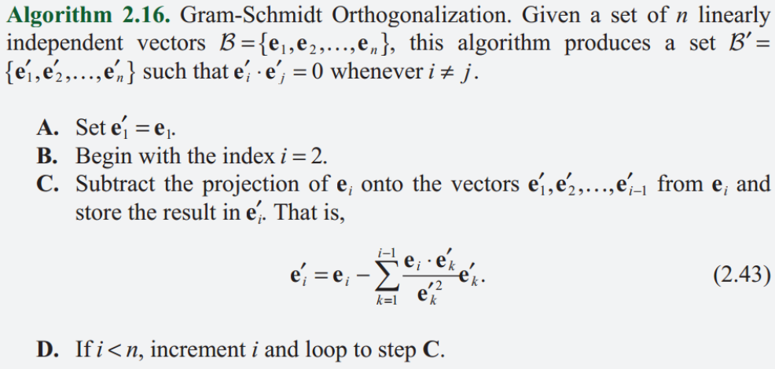

# 3D游戏与计算机图形学中的数学方法


## 第一章 渲染管线

### 1.1 图形处理器

CPU-GPU通信：

​		内存<---->CPU---->应用程序---->渲染库(如OpenGL)---->图形卡驱动---->GPU<---->显存

显存主要缓冲区：

1. 前后图像缓冲区切换,前：用户可见；后：用户不可见。切换要与屏幕刷新率同步，否则会画面撕裂，即不同时刻的画面出现在屏幕上，屏幕不同部分的画面来自不同缓冲区。
2. 深度缓冲区（z-缓冲区）：每个像素在图像中的深度值，即该像素里虚拟相机距离。因此可用于隐藏面剔除（只允许显示深度值小于图像缓冲区中像素的深度值的像素）。

###  1.2 顶点变换

​		为了将三维数据变换为二维的图像显示在屏幕上(这是目的，真正进行这步操作的是光栅化)，在模型坐标在世界坐标中映射入相机视界，再通过投影变换来实现近大远小，通过齐次裁剪保证只渲染视界以内元素。注意，顶点也是携带纹理坐标的，这样可以通过纹理映射找到颜色值。

​		个人理解为坐标变换。

### 1.3 光栅化和段操作

​		将几何元素经过变换填充至屏幕的过程称为光栅化。

​		光栅化后，GPU计算出每个像素的深度、各顶点插值的颜色、差值得出的纹理坐标与像素自己的位置合称为段数据。段数据经过段操作处理后便可写入图像缓冲区，以下是操作的过程

```flow
st=>start: 段数据
op2=>operation: 像素包含测试
op3=>operation: 裁剪测试
op4=>operation: Alpha测试
op5=>operation: 模板测试
op6=>operation: 深度测试
op7=>operation: 混合
ed=>end: 图像缓冲区

st(right)->op2(right)->op3(right)->op4(right)->op5(right)->op6(right)->op7(right)->ed
```

### 1.4  总结

​		这章主要介绍了3维物体在2维屏幕上展现的基本过程，主要是概念上的介绍。

```flow
st=>start: 三维数据
op1=>operation: 坐标变换
op2=>operation: 颜色计算
op3=>operation: 光栅化
ed=>end: 二维屏幕

st(right)->op1(right)->op2(right)->op3(right)->ed
```

## 第二章 向量

​		列向量$P$在$Q$上的投影$proj_QP$通过矩阵可表示为:

$$
\begin{align}
	proj_QP
	&=\frac{Q^TP}{||Q||}\\
    &=Q\frac{Q^TP}{||Q||^2}\\
	&=\frac{QQ^T}{Q^TQ}P\\
\end{align}
$$
,其中$\frac{QQ^T}{Q^TQ}$为投影矩阵。	

​		施密特正交化，**将集合中的每个向量减去该向量在其前面的所有向量上的投影**，则处理完后所有向量正交。



## 第三章 矩阵

​		逆矩阵，行列式，伴随矩阵，线性方程组，克莱姆法则，特征向量，实对称矩阵，矩阵对角化。

## 第四章 坐标变换

### 4.1 线性变换

&emsp;&emsp;设在3D坐标系$C_1$中$P$点坐标为$(x,y,z)$,将其转换到坐标系$C_2$，则$(x^{'},y^{'},z^{'})$为：
$$
\begin{bmatrix} x^{'}\\y^{'}\\z^{'}\end{bmatrix} =\begin{bmatrix} U_1&V_1&W_1\\U_2&V_2&W_2\\U_3&V_3&W_3\end{bmatrix} \begin{bmatrix} x\\y\\z\end{bmatrix}+ \begin{bmatrix} T_1\\T_2\\T_3\end{bmatrix}
$$
其中$U,V,W$组成的矩阵表示坐标轴变换的方式，$T$向量为$C_1$坐标系到$C_2$坐标系平移向量。

​		若变换矩阵为**正交矩阵**，则该变换可保持向量的长度和角度不变（向量的模不变确保物体的大小不变，向量的点乘不变确保物体的角度不变），因此正交矩阵只可用于旋转变换和反射变换或者是二者的组合。

​		旋转变换不改变手性，反射变换改变手性。因此，奇数次反射变换改变**原坐标系**手性，偶数次反射变换不改变**原坐标系**手性，且等价于旋转变换，故任意多的反射变换可分解为一次旋转变换加**最多一次**反射变换。若$M$为变换矩阵，$detM<0$说明改变了手性，$detM>0$说明为改变手性。

​		若$M$为正交阵，应用上述规律，由$detM=\pm1$,当$detM=1$，说明为一个旋转变换；$detM=-1$说明为一个旋转变换和一个反射变换的组合变换。

### 4.2 比例变换

​		通过左乘对角阵来进行$x,y,z$轴的比例变换，如果要沿任意轴变换，可先进行坐标系变换，再比例变换，再还原坐标系，如下。
$$
\begin{bmatrix} x^{'}\\y^{'}\\z^{'}\end{bmatrix} =
\begin{bmatrix} U_1&V_1&W_1\\U_2&V_2&W_2\\U_3&V_3&W_3\end{bmatrix}
\begin{bmatrix} a&0&0\\0&b&0\\0&0&c\end{bmatrix}
\begin{bmatrix} U_1&V_1&W_1\\U_2&V_2&W_2\\U_3&V_3&W_3\end{bmatrix}^{-1}
\begin{bmatrix} x\\y\\z\end{bmatrix}
$$

### 4.3 旋转变换

#### 4.3.1 二维

​		如果要求$P$逆时针旋转$\theta$得到的$P^{'}$，记$Q$为$P$逆时针旋转90°后的向量,即$(-P_y,P_x)$,则$P$与$Q$正好组成了**该平面内的一组正交向量**，任何向量都可由其线性表出，由基本几何和三角学可得到：
$$
P^{'}=Pcos\theta+Qsin\theta
$$

则
$$
\begin{aligned}P_x^{'}&=P_xcos\theta-P_ysin\theta\\
P_{y}^{'}&=P_ysin\theta-P_xcos\theta\\
\end{aligned}
$$
写成矩阵为
$$
P^{'}=\begin{bmatrix}cos\theta&-sin\theta\\sin\theta&cos\theta\end{bmatrix}P
$$

#### 4.3.2 三维绕坐标轴旋转


​		注意$R_y(\theta)$与其他不同是因为如果按照逆时针旋转，由$x\times z=-y$,则得到$y$轴负方向，因此需改为顺时针，即$-\theta$,这无论是在左手坐标系还是右手系都是相同的。

#### 4.3.3 三维绕任意轴旋转

​		  **向量$P$绕任意轴$A$旋转$\theta$角度证明：**

​		不妨设$A$为单位向量，同时$P$可分解为与$A$平行和垂直的两个分量，分别为：
$$
\begin{align}
P_{projA}&=(A\cdot P)A=AA^TP\\
P_{perpA}&=P-(A\cdot P)A=P-AA^TP
\end{align}
$$
如图所示


故最终结果
$$
P^{'}=P_{perpA}^{'}+P_{ProjA}
$$
其中$$P_{PerpA}^{'}$$为$$P_{perpA}$$旋转$$\theta$$后得到的向量，如图


为求得其值，需找到一组线性组合来表示它，可选$P_{perpA}$与其旋转90°后的向量这两个向量作为组合，可以得知$A\times P$即为该向量，同时它的长度是与$P_{perpA}$相等的，这是因为
$$
|A\times P|=|P|sin\alpha=|P-(A\cdot P)A|
$$
所以
$$
P_{perpA}^{'}=[P-(A\cdot P)A]cos\theta+(A \times P)sin \theta
$$
所以
$$
\begin{align}
P^{'}&=[P-(A\cdot P)A]cos\theta+(A \times P)sin \theta+(A\cdot P)A\\
&=Pcos\theta+A\times P sin\theta+(A\cdot P)A(1-cos\theta)
\end{align}
$$
记$I$为单位阵，则矩阵形式为
$$
P^{'}=\{Icos\theta+\begin{bmatrix} 0&-A_z&A_y\\A_z&0&-A_x\\-A_y&A_x&0\end{bmatrix}sin\theta+AA^T(1-cos\theta)\}P
$$
其中记
$$
R=Icos\theta+\begin{bmatrix} 0&-A_z&A_y\\A_z&0&-A_x\\-A_y&A_x&0\end{bmatrix}sin\theta+AA^T(1-cos\theta)
$$
为罗德里格斯旋转公式，而将其展开写成一个矩阵就可得到旋转矩阵。


### 4.4 齐次坐标

​		引入第四维度，即四维矩阵$F$得描述来取代之前得三维矩阵的线性变换，这两者是等效的。
$$
F=\begin{bmatrix}M_{33}&\vdots&T_{13}\\0&\vdots&1\end{bmatrix}
$$
这是一个分块矩阵，由之前线性变换中的三维矩阵$M$和三维向量$T$组成，同时我们用$\{x,y,z,1\}$代表点，$\{x,y,z,1\}$代表向量。


### 4.5 法向量变换

​		当物体经过变换后，其原表面上的法向量就不一定与原来相同了，尤其是发生形变后。不妨设$n,t$分别为变换前的法向量与切向量，$n^{'},t^{'}$为变换后正确的法向量与切向量。则
$$
\begin{align}
t^Tn=0\\
t^TM^T(M^T)^{-1}n=0\\
(Mt)^T(M^{-1})^Tn=0\\
t^{'T}n^{'}=0
\end{align}
$$
即切向量的变换方法为左乘$(M^{-1})^T$,那么如果$M$为正交阵，法向量的变换为$Mn$,这也就是说，如果变换时不改变物体的大小形状，法向量的变换是与物体相同的。


### 4.6 四元数

​		$q=(w,x,y,z)=w+xi+yj+zk$为四元数，有实部和虚部组成。四元数$q=s+v$的共轭为$\bar q=s-v$,

有，
$$
q\bar q=\bar q q=|q|^2=q^2
$$
故$q$的倒数$q^{-1}$为：
$$
q^{-1}=\frac{\bar q}{|q|^2}
$$
​		三维中P点的旋转描述为：
$$
\varphi(P)=qPq^{-1}
$$
其中，$q=cos\frac{\theta}{2}+Asin\frac{\theta}{2}$,${A}$为任意单位旋转轴，$\theta$为旋转角度。函数$\varphi$为同态函数，其映射满足长度，角度，偏手性不变。

#### 4.6.1 球面线性插值

​		普通线性插值方法：
$$
q(t)=\frac{(1-t)q_1+tq_2}{||(1-t)q_1+tq_2||}
$$
​		

其变化率可用$cos^{-1}(q(t)\cdot q_1)$表示，由于其随$t$的变化率不为常数，因此旋转不是匀速的。

​		引入球面线性插值：
$$
q(t)=\frac{sin[(1-t)\theta]}{sin\theta}q_1+\frac{sin(t\theta)}{sin\theta}q_2
$$
其中$\theta=cos^{-1}(q_1\cdot q_2)$,也可用$sin\theta=\sqrt{1-(q_1\cdot q_2)^2}$来计算。
