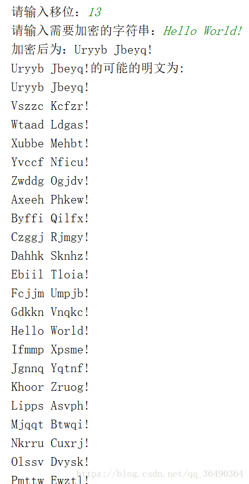

在密码学中，恺撒密码是一种最简单且最广为人知的加密技术。它是一种替换加密的技术，明文中的所有字母都在字母表上向后（或向前）按照一个固定数目进行偏移后被替换成密文。例，当偏移量是3的时候，所有的字母A将被替换成D，B变成E，以此类推。

```python
n=input("请输入移位：")
n=int(n)
str_mi=input("请输入需要加密的字符串：")

def jiami(str_1,n):
    ans=list(str_1)
    for i in range(0,len(ans)):
        if ans[i].islower():
            num = ord(ans[i])
            ans[i] = chr((num - 97 + n) % 26 + 97)
        if ans[i].isupper():
            num = ord(ans[i])
            ans[i] = chr((num - 65 + n) % 26 + 65)
    return ''.join(ans)
def jiemi(str_1):
    print(str_1+"的可能的明文为:")
    for i in range(0,25):
        print(jiami(str_1,i))

print("加密后为："+jiami(str_mi,n))
jiemi(jiami(str_mi,n))
```
