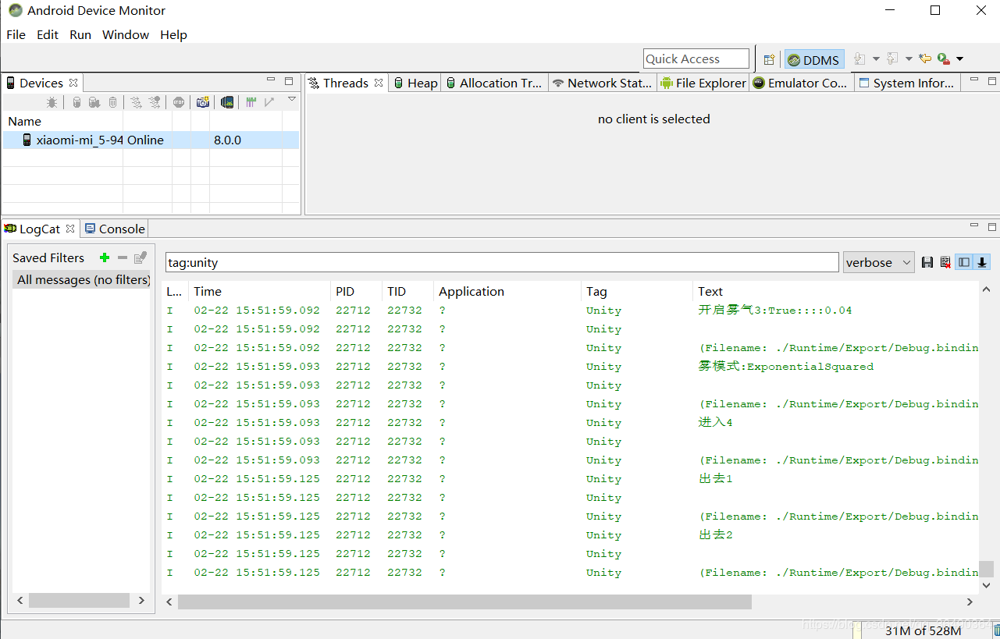

## Unity Android真机测试
两种方法,首先在你需要debug的代码位置用Debug.log("你想要的信息")

## 一.wifi
1.手机连数据线,要求电脑,手机同一网段,手机调试模式
2.adb tcpip 5555 //port
3.adb connect <ip>
4.adb devices //检查是否连接
5.unity中build and run
6.unity中edit->preferences 找到sdk路径 复制 在我的电脑中打开 找到tools文件夹下的monitor打开，搜索栏输入：tag:Unity 观察
## 二.usb
1.手机连数据线,手机调试模式,允许usb 安装 (发现有些手机要有sim卡才能开启usb安装)
2.unity中build and run
3.unity中edit->preferences 找到sdk路径 复制 在我的电脑中打开 找到tools文件夹下的monitor打开，搜索栏输入：tag:Unity 观察
ps:其中第2步可用以下2步代替
①.unity打包出apk
②.cmd中adb -s <设备号> install -r <apk路径> //设备号可用adb devices 查看

**Montitor的界面**
下面是通法,不仅仅适用于unity,可以测试任何apk,这是以前开发安卓时用到的,上面两种其实是特例罢了,
1.连数据线,手机调试模式,允许usb 安装 
2.用android studio(或者其他IDE)打包出apk
3.adb -s <设备号> install -r <apk路径> //设备号可用adb devices 查看
4.找到sdk路径 复制 在我的电脑中打开 找到tools文件夹下的monitor打开，搜索栏输入：tag:<xxx> 观察,也可以是pid:<xxx>,app:<xxx>,text:<xxx>

ps:以上所有<> 在输入的时候都不同打出来,我只为为了表示这里填的是一个值;
用wifi的方法我没试过,因为以前都是用usb连接的习惯了,如果第一种方法有失效请告知