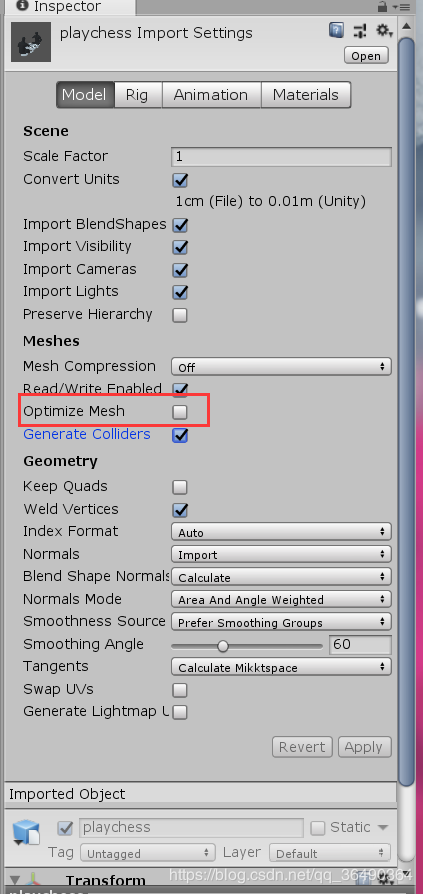

**1.前言**
&emsp;&emsp;如何导入看这篇文章，[链接](https://blog.csdn.net/woerxi/article/details/64922563?depth_1-utm_source=distribute.pc_relevant.none-task&utm_source=distribute.pc_relevant.none-task)，讲的很清楚了
**2.问题及解决**
&emsp;&emsp;出现mapping of XXX failed,查了好多资料，最后还是好不容易翻墙找到了[官网](http://www.west-racing.com/mf/?page_id=1335)才知道，这个也太偏僻了

```
	Make sure you are using local space point cache files, so for example
if you are using Max make sure you use the Object Space Point Cache 
Modifier as opposed to the World Space version and in other packages 
be sure to click the local space option box in the exporters.
	Also if you have Mapping Failures check to see if the Optimize Mesh
option is turned off in the Unity FBX import settings.
```
第一种是坐标问题，我是第二种情况，这个勾去掉就ok



还有，我补充一句，添加point cache组件的object一定是max里用点缓存的，也就是说，该是哪个物体就给哪个物体，这个不要给了父物体