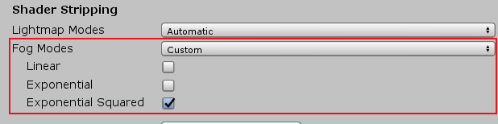

## Unity打包apk后雾效果消失

&emsp;&emsp;今天测试一个雾的效果时，发现在电脑上play有用，等打包到apk时就失效了。讲一下避免以下坑吧。

 **1.环境**
unity2018

**2.解决方法**
Edit->Project Settings->Graphics 找到Shader Stripping 中fog mode设置为custom（原来是Automatic）,然后选中你想要的模式，最后重新打包就ok

这三种模式的介绍请看另一篇吧
[unity fog雾的三种模式](https://blog.csdn.net/qq_36490364/article/details/104444197)