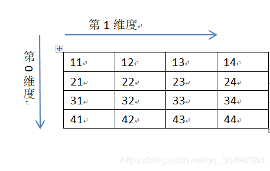

## 环境
python 3.6
numpy
**1.背景**
	今天有人问我numpy中[1:3,None]是啥意思,一开始讲得云里雾里,后来终于理清了，我们逐步深入研究♂(滑稽)
**2.一维情况**

```python
import  numpy as np
a=np.array([1,2,3,4])
print(a[0:3:2])
```
输出

```python
[1 3]
```

一维应该都知道吧 跟list差不多 [Start:End:Step] 注意是不包含End
**2.二维情况**


```python
import  numpy as np
a=np.array([[11,12,13,14],[21,22,23,24],[31,32,33,34],[41,42,43,44]])
print(a[0:4:2,0:4:2])
```
输出

```python
[[11 13]
 [31 33]]
```
所以第0维取0到4步长为2 ，第1维也取0到4步长为2 ，所以意思是[第0维,第1维]，然后多维类推嘛，应该能理解了吧
**3.关于None**
再说说一开始的[:,None]
<font color=red size=5>emmmm简单说就是说它增加了一个维度</font>
但还是有些不同的，看例子

```python
import  numpy as np
a=np.array([[11,12,13,14],[21,22,23,24],[31,32,33,34],[41,42,43,44]])
print('0维为None:')
print(a[None,0:4])
print('1维为None:')
print(a[0:4,None])

```
输出

```python
0维为None:
[[[11 12 13 14]
  [21 22 23 24]
  [31 32 33 34]
  [41 42 43 44]]]
1维为None:
[[[11 12 13 14]]

 [[21 22 23 24]]

 [[31 32 33 34]]

 [[41 42 43 44]]]
```
看下官方文档,[链接](https://www.numpy.org/devdocs/reference/arrays.indexing.html)
```python
Note:
Remember that a slicing tuple can always be constructed as obj and used in the x[obj] notation. 
Slice objects can be used in the construction in place of the [start:stop:step] notation.
For example, x[1:10:5,::-1] can also be implemented as obj = (slice(1,10,5), slice(None,None,-1)); 
x[obj].This can be useful for constructing generic code that works on arrays of arbitrary dimension.
```

```python
numpy.newaxis
The newaxis object can be used in all slicing operations to create an axis of length one.
newaxis is an alias for ‘None’, and ‘None’ can be used in place of this with the same result.
```
它巴拉巴拉的意思就是<font color=red size=5>numpy.newaxis效果和None是一样的，None是它的别名</font>

```python
print(None is np.newaxis)
True
```

(话说为了少打点字（len(None)<len(numpy.newaxis)）,可能就会让初学者看不懂- -，但是告诉他们答案我想他们肯定想暴打写代码的人♂（呼应前文滑稽）)
想更详细的知道numpy.newaxis的可以自己去搜搜啦