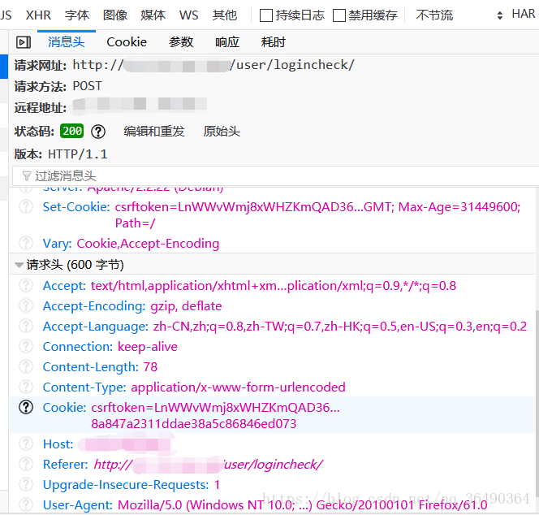
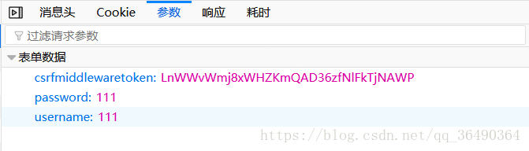
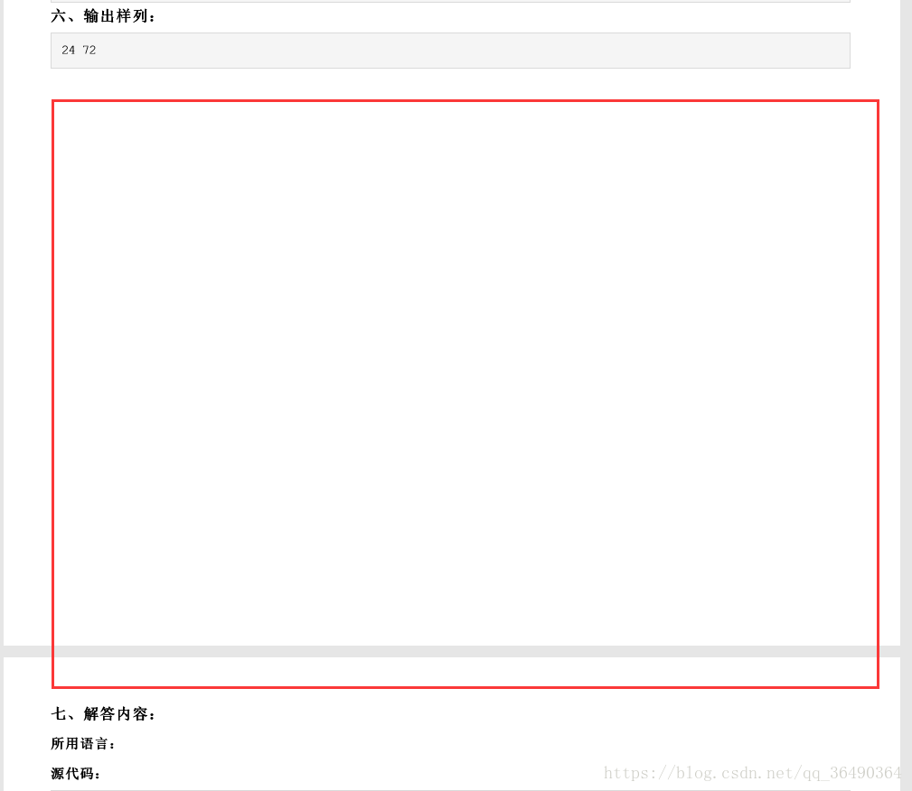
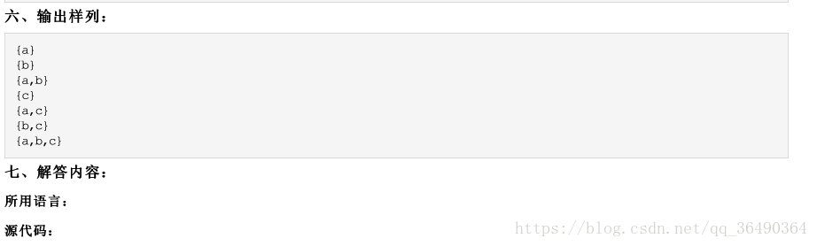

需求时这样的：学校有一个判题网，当期末的时候要把提交的结果一页一页的打印成pdf交给老师
因为是内网，模拟登录十分简单我就简单写一下，但是我在使用pdfkit时出现了一些问题（强迫症问题），最终也没找到很好的解决方法，如果有dalao有想法恳请告诉 - -！
## 环境：

python3.6
**涉及的库:**
requests
pdfkit
re
**1.模拟登录**

登录的url如上 我们关注hearder里最后几个就行，先构造出来header

```
header={
'uer-aGent':'Mozilla/5.0 (Windows NT 10.0; Win64; x64; rv:61.0) Gecko/20100101 Firefox/61.0',
'Referer':'http://**.***.***.***/',
'Host':'**.***.***.***'
}
```

这是需要post的参数，第一个参数csrfmid...啥的我们发现就是cookie中的一个

接下来我们来讲讲如何获取cookie，因为是学生自己用的，验证很low，我们先通过requests.Session（）获得一个session（这里不懂的强烈建议先去搞懂Session和Cookie），我们先通过session.get（）先尝试登录一下，因为我们没有提交任何表单数据，毫无疑问是失败的，但是我们却因此获得了cookie，具体看代码，十分简单
```python
import requests
import re
import time
import pdfkit

postdata={
'password':'******',
'username':	'*******'
}
session = requests.Session()
#登录
def Getcookiesandlogin():
    posturl = 'http://**.***.***.***/user/logincheck/'
    session.get('http://**.***.***.***/',headers=header)#通过这次来获取cookie
    postdata['csrfmiddlewaretoken']=session.cookies.get_dict()['csrftoken']#把cookie加入表单参数中
    session.post(posturl, data=postdata,headers=header)
```
**2.pdfkit**
pdfkit依赖于[wkhtmltopdf](https://wkhtmltopdf.org/downloads.html)，链接为下载地址，我下的是windos的MXE (MinGW-w64)，直接解压就行，使用的时候设置一下路径参数就ok
```python
path='E:/wkhtmltopdf/wkhtmltox/bin/wkhtmltopdf.exe'#你解压后的路径
config = pdfkit.configuration(wkhtmltopdf=path)
```

先说最后都没有解决的问题吧，看两幅图片的对比
1.

2.
emmm，就是空白（红框圈出），打印pdf的时候会出现空白，而且这些空白是有些pdf有，有些pdf没有的，而这些空白也不仅仅是出现在页与页的分隔之间。。。
*只截取关于pdfkit的一段代码吧（这是最后的）*

```python
        text=session.get(url)
        css=['E:\Pycharm\MyProjects\monidenglupanti\css\shCore.css','E:\Pycharm\MyProjects\monidenglupanti\css\shThemeDefault.css',
             'E:\Pycharm\MyProjects\monidenglupanti\css\global.css','E:\Pycharm\MyProjects\monidenglupanti\css\group.css',
             'E:\Pycharm\MyProjects\monidenglupanti\css\printstyle.css']
        name=re.findall(r'<title>(.*) </title>',text.text)[0].replace(' ','')
        name=name.replace(':','_')
        path='E:/Pycharm/MyProjects/monidenglupanti/'+name+'.pdf'
        h=text.text.replace('/js/media/js/scripts/','js/')
        h = text.text.replace('/js/media/js/', 'js/')
        #这里外链的路径变成‘C:\Users\76083\AppData\Local\Temp\’，改成其他路径失效，没解决- -！
        pdfkit.from_string(h,output_path=path,configuration=config,css=css)
```
苦逼历程：
1.一开始，发现打印的pdf没有样式，好，把网页的样式下载下来，添加进去，
后来发现，打印出来的pdf还是有些小地方不一样，想破脑袋，此处省略万字。。。
2.突然想到有些应该是javascript动态生成的！好，咱再把他也全部下载下来
（下载方法：Internet选项-常规-先点删除-选择临时文件(全清了也ok就当清理垃圾了)-删除后刷新一下你要下载的网页-再点设置-再点查看文件，好，里面就全是这个网站的css和js文件了）。
3.然后加载javascritpt，把网页中js的相对路径改成我需要的觉得路径，发现又发现设置其他盘无用（它还是会ignore）只能设置在‘C:\Users\76083\AppData\Local\Temp\’？？？算了，屈服
4.满心欢心运行效果，样式啥的全对了，看到空白，强迫症卒