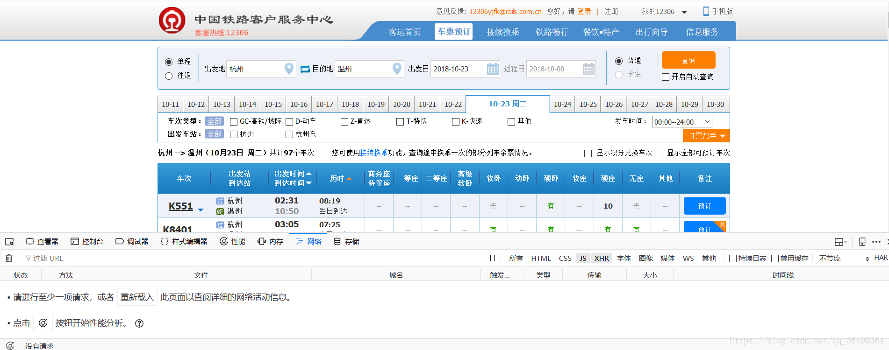
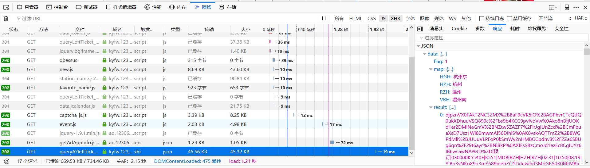
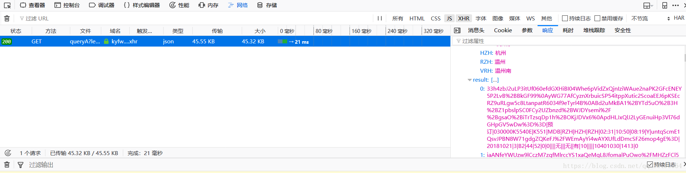
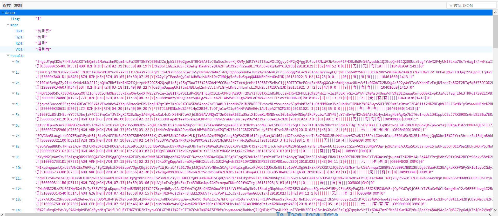
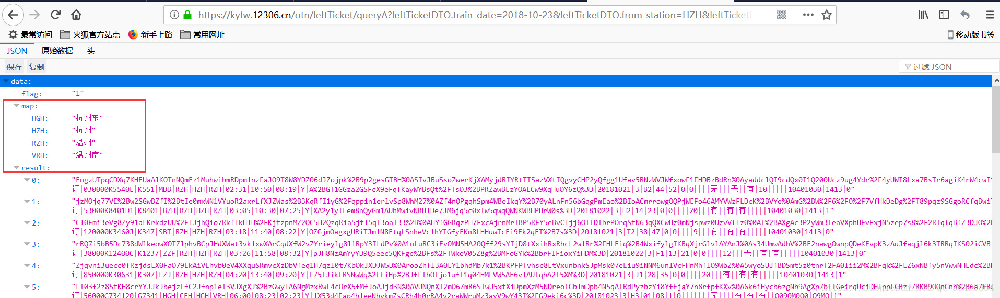
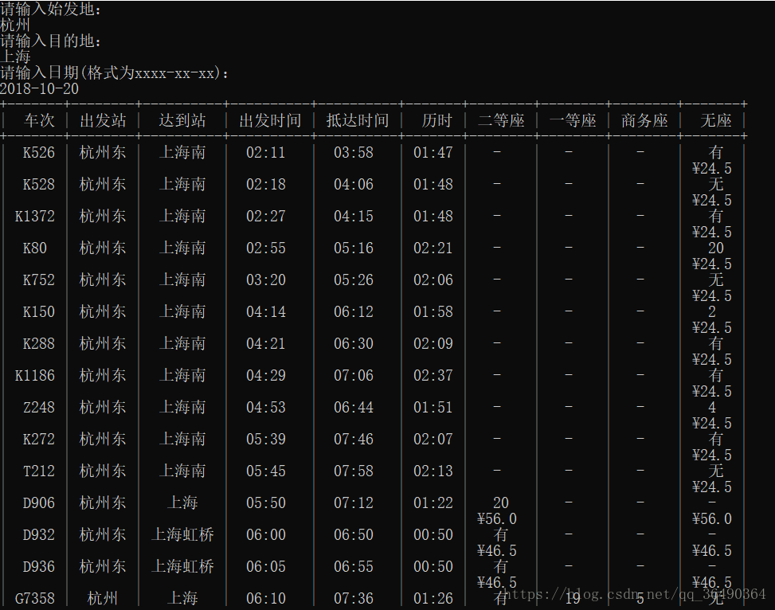

还原整个思路，遇到的一些问题也会写出来，纯新手向，因为打包在了一个类里，所以单独拷贝一个函数可能会有些问题,后面有完整代码地址，如有错误可以指正- -有问题也可以留言，后面写的有些赶，可以去完整源代码中看看
截至2018/10/9   0:15代码还是有效的

## 环境：

python3.6
**涉及的库:**
requests
json
prettytable
re
pprint
**1.url分析**
	先打开[12306的余票查询](https://kyfw.12306.cn/otn/leftTicket/init)，我用的是火狐浏览器，按F12打开调试工具选择network（网络）选项，选择出发地，目的地，日期，点击查询
	
（小白问题：调试窗口里啥也没有是因为 你一番操作猛如虎，结果完事后想起：哎？调试窗口没打开！）
右上角有一排选项，咱选js，xhr 然后从这一条条里找出我们需要的链接（点的时候在右边选择响应，可以看到这条请求返回啥）哇塞！你找到一串data，里面还有各种车票的信息，好了，就是你了：
https://kyfw.12306.cn/otn/leftTicket/queryA?leftTicketDTO.train_date=2018-10-23&leftTicketDTO.from_station=HZH&leftTicketDTO.to_station=RZH&purpose_codes=ADULT

**PS**：找json链接这种活就看经验了，老手可能马上就能找到，新手可能就要一条条点（汗~~）我这给一个快速的方法：进入余票查询界面，选择好出发地和目的地及日期，点击查询，好！然后再打开F12调试界面在点查询！哇塞只有1条而且就是我们需要的！（深入原因的话就是在你打开了调试界面后你只进行了这一条查询的post请求，而返回的当然就是你要的了）

好,继续正题,我们来观察这条json的链接,很容易明白那些参数吧,如下:
https://kyfw.12306.cn/otn/leftTicket/queryA?leftTicketDTO.train_date=2018-10-23&leftTicketDTO.from_station=HZH&leftTicketDTO.to_station=RZH&purpose_codes=ADULT
leftTicketDTO.train_date=日期
leftTicketDTO.from_station=出发点的地点码
leftTicketDTO.to_station=目的地的地点码
purpose_codes=票的种类
**2.获取车站对照字典**
上文链接中有两个参数是地点码,即一个地名对应一个值,一开始我是直接下载了网上(baidu喽)的一个字典,然后最后写完.不对!我靠!而且调试半天定位到字典错了!(这么多的地名偏偏被窝测试到错误的也是没谁了...）

好!自己动手!

```python
import requests
import re
#生成字典 运行一次后抛弃之~~~
def new_dictionary():
    url="https://kyfw.12306.cn/otn/resources/js/framework/station_name.js?station_version=1.9069"
    station_namesweb=requests.get(url)
    stationdic = re.findall(r'([\u4e00-\u9fa5]+)\|([a-zA-Z]+)', station_namesweb.text)
    stationdic=dict(stationdic)
    print(stationdic)
new_dictionary()
```
requests请求,json打包,正则提取,over!
打印出一个字典复制然后在一个文件里就ok了(上面代码中的url其实也是一样找的,可以试试手去找找看)哈哈,其实这也是今天整个工程的浓缩版吧,思路也是差不多的
**3.输入出发点,目的地,时间,获得需要的查询链接**
废多看码!!!

```python
    def getUrl(self):
        startflag = False
        endflag = False
        while startflag == False:
            start = input("请输入始发地：\n")
            startflag = stations.__contains__(start)
            if startflag == False:
                print('始发地输入错误！')
        while endflag == False:
            end = input("请输入目的地：\n")
            endflag = stations.__contains__(end)
            if endflag == False:
                print('目的地输入错误！')

        self.date = input("请输入日期(格式为xxxx-xx-xx)：\n")

        url = 'https://kyfw.12306.cn/otn/leftTicket/queryA?leftTicketDTO.train_date=' \
              + self.date + '&leftTicketDTO.from_station=' \
              + stations[start] + '&leftTicketDTO.to_station=' \
              + stations[end] + '&purpose_codes=ADULT'
        return url
```
**4.获取车辆信息**
因为12306在这里没做啥验证所以可以直接请求,不妨直接在浏览器里看一下,emmm是不是头都大了!!!!

车辆的信息都在这里了,用|分隔开,我们要做的就是从里面提取出我们想要的信息,emmm其实我花的时间最多的是在这里,因为要一一对应知道每个信息代表什么,而我又找不到那么一辆每个信息都齐全的车来让我对照...只能用好几辆的信息来对比喽（还不一定是对的，眼力有限）...我的眼睛!!!


> `乱码|预订|030000K5540E|K551|MDB|RZH|HZH|RZH|02:31|10:50|08:19|Y|乱码|20181021|3|B2|44|52|0|0||||无|||无||有|10|||||10401030|1413|0`
>
> 上代码:
```python
    def getData(self,url):
        dataweb = requests.get(url)
        datajson = json.loads(dataweb.text)
        datatrains = datajson['data']['result']
        restations=datajson['data']['map']#地点缩写：地点全称的字典
        dataans = []
        for train in datatrains:
            per = {
                'train_no': '',
                'from_station_no': '',
                'to_station_no': '',
                'seat_types': '',
                'chufazhan':'',
                'dadaozhan':'',
                'checi': '',
                'chufasj': '',
                'didasj': '',
                'lishi': '',
                'erdeng': '',
                'yideng': '',
                'shangwu': '',
                'wuzuo':''
            }
            train = train.split('|')
            per['train_no'] = train[2]
            per['from_station_no'] = train[16]
            per['to_station_no'] = train[17]
            per['seat_types'] = train[35]
            per['chufazhan']=train[6]
            per['dadaozhan']=train[7]

            #将得到站点名字由缩写转换全称
            per['chufazhan']=restations[per['chufazhan']]
            per['dadaozhan']=restations[per['dadaozhan']]

            per['checi'] = train[3]
            per['chufasj'] = train[8]
            per['didasj'] = train[9]
            per['lishi'] = train[10]
            per['erdeng'] = train[30]
            per['yideng'] = train[31]
            per['shangwu'] = train[32]
            per['wuzuo']=train[26]
            for value in per:
                if (per[value] == ''):
                    per[value] = '-'
            dataans.append(per)
        return dataans
```
PS：这里有个问题要说明下：比如我朋友温州-金华，而金华有两个站，他只要其中一个站的，所以我们得显示出出发站和抵达站到底是哪个，但是在信息中我们获得地点是一个码而不是一个站的名字，而我们的字典中是 {名字：码}，一开始我想要不干脆再做个反转的字典，后来往上翻的时候发现：原来上面已经给我们了！解决！计划通~

**5.获取票价信息**
票价的url是另外一条了,获取方式同上上,老方法请求,解析,打包
```python
    def GetPrice(self,train_no,from_station_no,to_station_no,seat_types,date,price):
        url = 'https://kyfw.12306.cn/otn/leftTicket/queryTicketPrice?train_no=' \
              + train_no + '&from_station_no=' \
              + from_station_no + '&to_station_no=' \
              + to_station_no + '&seat_types=' \
              + seat_types + '&train_date=' + date
        priceweb=requests.get(url)
        pricejson=json.loads(priceweb.text)
        pricedata=pricejson['data']
        shangwu=pricedata.__contains__('A9')#商务
        yideng=pricedata.__contains__('M')#一等
        erdeng=pricedata.__contains__('O')#二等
        wuzuo=pricedata.__contains__('WZ')#无座
        if shangwu:
            price['shangwu']=pricedata['A9']
        else :
            price['shangwu']=''
        if yideng:
            price['yideng']=pricedata['M']
        else :
            price['yideng']=''
        if erdeng:
            price['erdeng']=pricedata['O']
        else :
            price['erdeng']=''
        if wuzuo:
            price['wuzuo']=pricedata['WZ']
        else :
            price['wuzuo']=''
        return price
```
**6.输出**
用了prettytable库输出表格
```python
    def Print(self):
        price={
            'shangwu':'',
            'yideng':'',
            'erdeng':'',
            'wuzuo':'',
        }
        table = prettytable.PrettyTable()
        table.field_names = ["车次","出发站","达到站" ,"出发时间", "抵达时间", "历时", "二等座", "一等座", "商务座","无座"]
        for per in self.data:
            price=self.GetPrice(per['train_no'],per['from_station_no'],per['to_station_no'],per['seat_types'],self.date,price)
            table.add_row([per['checi'],per['chufazhan'],per['dadaozhan'], per['chufasj'], per['didasj'], per['lishi'], per['erdeng']+'\n'+price['erdeng'], per['yideng']+'\n'+price['yideng'],
                           per['shangwu']+'\n'+price['shangwu'],per['wuzuo']+'\n'+price['wuzuo']])
        print(table)
```
**7.演示**

8.完整代码
https://github.com/senjay/12306tickets_and_price_search