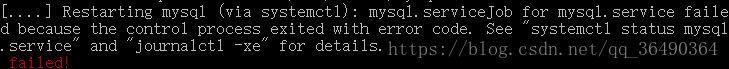

**1.Unable to locate package xxx** 


解决方法:

    sudo apt-get update

**2.远程登录**
		选择创建一个用于远程登录的用户:

```shell
	GRANT ALL PRIVILEGES ON *.* TO 'username'@'%' IDENTIFIED BY 'password' WITH GRANT OPTION;
```
生效:

```shell
flush privileges;
```
​		接下来一步,看了网上许多说的,都是vim /etc/mysql/my.cnf 将里面的bind-address = 127.0.0.1改为0.0.0.0,我试了下 然后进行重启服务(/etc/init.d/mysql restart),最后遇到报错:
mysql.serviceJob for mysql.service failed because the control process exited with error code. See "systemctl status mysql.service" and "journalctl -xe" for details.failed!



???

回去 仔细看/etc/mysql/my.cnf
我去!!!

emm他的意思是说配置文件在那俩目录下...果然在操作的时候还是要仔细看下的- -
两个我都进去看了下 结果是在

```shell
vim  /etc/mysql/mysql.conf.d/mysqld.cnf
```
找到bind-address改为0.0.0.0(任意ip可访问),也可以设成自己的,在第一次那个文件里我还好奇咋没有bind-address,虎得我直接加了一行上去...


重启服务  /etc/init.d/mysql restart  ,ok
Navicat连接测试成功


**重要**
netstat -anp|grep 3306
查看3306端口有没有开启,没有的话去阿里云那添加安全规则,不细写了

