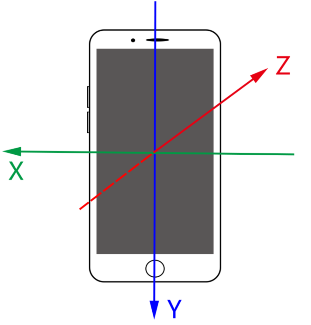
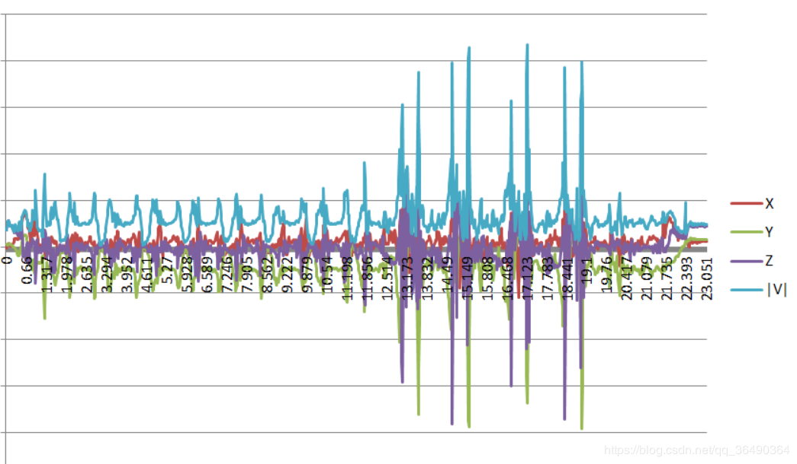
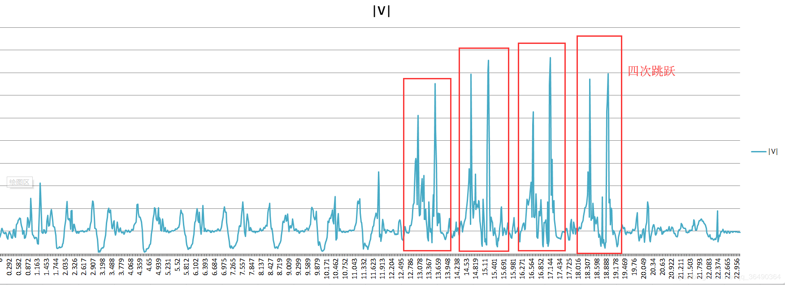
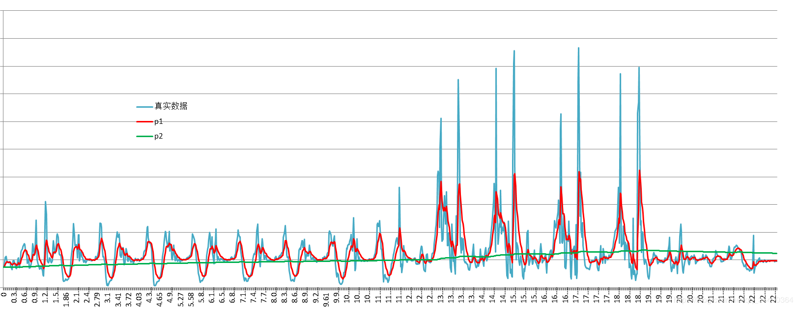

## 加速度传感器的计步算法Pedometer
**1.前言**
&emsp;&emsp;最近要使用到计步，查了很多资料，以下是一个简易的计步算法，也能检测跳跃

**2.工具**
&emsp;&emsp;[一个实时绘制Android加速度的APP](https://download.csdn.net/download/qq_36490364/12193880)

**3.内容**
 1. Android的加速传感器的介绍

	&emsp;&emsp;Android上的加速度传感器的方向如下所示（当你面朝手机屏幕观察），这是一个右手坐标系。因此加速度是由三个正交的向量组成的，例如当你平放手机在桌子上屏幕朝上，此时应为（0，0，9.6左右）

 2. 使用g-sensor对数据进行分析
 	&emsp;&emsp;打开这个工具后进行走路和跳跃，然后导出数据，以时间为横轴画出折线图
 	我们多实验几组实验后会发现，当手机以不同的姿态放入口袋然后进行运动时，xyz三轴的数据是不确定的，但是三者矢量和的模却是有规律的（其实真正的加速度被正交分解了），因此我们接下来应该分析的是它们的模|V|
 	&emsp;&emsp;上图中可以知道，每次走路都会产生一个波峰和波谷，而跳跃的振幅相对大一些。因此判断行走只需判断波峰波谷就行

 3. 数据处理
	&emsp;&emsp;不妨记第$i$个时间单位获取到的加速度的三个矢量和的模大小为$x_i$，为了使数据更加平滑，分别使用两次的指数滤波(EMA)
	$$
\left\{
\begin{aligned}
a_{i}&=（1-p_1）a_{i-1}+p_{1}x_{i}\\
b_{i}&=（1-p_2）b_{i-1}+p_{2}x_{i}\\
a_{0}&=b_{0}=x_{0}\\
p_{1}&>p_{2}\\
\end{aligned}
	\right.
	$$
	
	

&emsp;&emsp;其中$a_i$是拟合曲线，$b_i$均值，因此${\Delta{h}=a_i-b_i}$即波峰波谷的高度差,得到${\Delta{h}}$后再跟设置好的${k_1,k_2,k_3}$比较（其中${k_1>k_2>k_3}$)。判别结果如下,
$$
\left\{
\begin{aligned}
&jump,\Delta{h}>k_1\\
&walking,\Delta{h}>k_2\\
&standing,\Delta{h}<k_3\\
\end{aligned}
\right.
$$
&emsp;&emsp;需要注意的是.一旦检测到跳跃或者行走,就得有计时器计时,当经过$\Delta t$后再进行判别,因为人走路和跳跃是需要时间的!!!

​		其中$p_1$,$p_2$,$k_1$,$k_2$,$k_3$,$\Delta t$ 都是需要我们设置的参数，下面分享一组**手调**测出来的参数QAQ，不一定最优但能行。。。
$$
\left\{
\begin{aligned}
p_1&=0.2\\
p_2&=0.002\\
k_1&=0.25\\
k_2&=0.13\\
k_3&=0.008\\
\Delta t&=2s
\end{aligned}
\right.
$$

&emsp;&emsp;上图是带入这些参数得到的曲线，我们可以看到经过$p_1$参数的滤波得到的曲线(红色)，已经大致拟合原数据(蓝色)，而经过$p_2$参数得到的曲线(绿色)大致为均值,要说一下的是其实绿线的值大致在9.8附近,就是重力加速度,为什么不直接采用9.8的原因是实际会有误差。

​		至于为什么会选EMA，简单有效！我们其实可以发现其公式可以用线性插值函数快速实现,虽然没人说，但我觉得在很多时候我们平滑移动物体和相机用到这个插值基于的原理就是这个，在每帧不断迭代才产生了平滑。

$$
a_i=Mathf.Lerp(a_{i-1 },x_i,p_1)=a_{i-1}+(1-p_1)x_i=(1-p_1)a_{i-1}+p_1x_i
$$

**3.实现**
[Unity下的实现](https://blog.csdn.net/qq_36490364/article/details/104515912)
 	