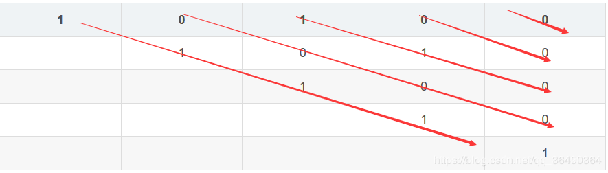

**描述**
&emsp;&emsp;给定一个字符串 s，找到 s 中最长的回文子串。你可以假设 s 的最大长度为 1000。

```c++
输入: "babad"
输出: "bab"(注意: "aba" 也是一个有效答案。)
输入: "cbbd"
输出: "bb"
```
&emsp;&emsp;dp,除此之外还有一些很炫的解法，这里只讲dp这是一道很好的入门题。
&emsp;&emsp;我一向认为dp第一步不是写状态转移方程，而是把状态设对。涉及到字符串的子串起码应该想到二维数组$dp_{ij}$,至于这个代表什么，就是手感了，设的好方程~~推~~ （猜）的轻松，否则基本gg；
&emsp;&emsp;这里直接给答案，$dp_{ij}$表示以$s_i开头至以s_j$结尾的串.如果$s_i...s_j$为回文串，那么$s_{i-1}...s_{j+1}$为回文串的条件就是$s_{i-1}==s_{j+1}$。

```c++
初始状态：dp[i][i]==true;           i∈1...n
dp[i][j]=dp[i+1]d[j-1]&&(s[i]==s[j]) 
```
画表理解一下，以babad为例，填的顺序是斜着填的


| 1    | 0    | 1    | 0    | 0    |
| ---- | ---- | ---- | ---- | ---- |
|      | 1    | 0    | 1    | 0    |
|      |      | 1    | 0    | 0    |
|      |      |      | 1    | 0    |
|      |      |      |      | 1    |


上代码

```c++
class Solution {
public:
    string longestPalindrome(string s) {
        int len=s.length();
        vector<vector<bool>> d(len, vector<bool>(len));
        int max=1,p=0,flag=1;
        for(int i=0;i<len;i++)//初始化
            d[i][i]=true;
        for(int j=1;j<len;j++)
        {
            for(int i=0;i<len-j;i++)
            {
                if(j==1)//长度为2的串
                {
                    d[i][j+i]=(s[i]==s[i+1]);
                    if(d[i][i+1]&&flag)//flag用于只记录第一个长度为2的回文串，不用也没关系
                    {
                        max=2;
                        p=i;
                        flag=0;
                    }
                }
                else//长度大与2的串
                {
                    d[i][j+i]=d[i+1][i+j-1]&&(s[i]==s[i+j]);//转移方程
                    if(d[i][j+i]&&j+1>max)
                    {
                        max=j+1;
                        p=i;
                    }
                }
            }
        }
        return s.substr(p, max);//从p开始切割max位
    }
};
```