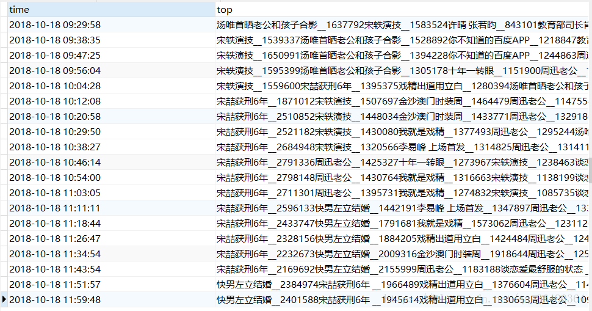

## 环境：

python3.5.2
**涉及的库:**
requests
bs4
pymysql
**服务器:**
Ubuntu16.04
**1.代码**

```python
import requests
import datetime
import time
import pymysql
from bs4 import BeautifulSoup
import random
hottime=''#时间
sql = "insert into hottop(time,top)values(%s,%s)"
db = pymysql.connect("数据库的ip","数据库用户名","密码","weibohot")
cursor = db.cursor()

def Gethot():
    url = 'https://s.weibo.com/top/summary?cate=realtimehot'
    #这里为了稳定,可以添加一个user-Agent的池,然后每次用的时候随机一个,也可以添加ip池
    header={
        'User-Agent':'Mozilla/5.0 (Windows NT 10.0; Win64; x64; rv:61.0) Gecko/20100101 Firefox/61.0'
    }
    try:
        # global 声明接下来用的hottime是全局变量,
        # 如果不加这个,它会变成局部变量,即使你在函数外声明了一个hottime
        global hottime
        hottime = datetime.datetime.now().strftime("%Y-%m-%d %H:%M:%S")
        hotweb = requests.get(url, headers=header, timeout=10)
    except:
        print(hottime+':http Error')
    else:
        soup = BeautifulSoup(hotweb.text, "html.parser")
        ans = soup.find_all('td')
        top = ''
        for i in ans:
            a = i.find('a')  # a标签内容，即热搜内容
            span = i.find('span')  # span标签内的的热度
            if (a != None and span != None):
                top += a.get_text() + '__' + span.get_text() + '\n'
        return top

errorcount=0#5次错误跳出循环
while True:
    try:
        top = Gethot()
        cursor.execute(sql,(hottime,top))
    except Exception as e:
        errorcount+=1
        db.rollback()
        print(hottime+":执行MySQL: %s 时出错：%s" % (sql, e))
        if(errorcount==5):
            break
        else:
            time.sleep(10)
            continue
    else:
        db.commit()
        time.sleep(random.randint(450,550))#每次sleep随机450-550秒
```

**2.数据表**

| time     | top           |
| -------- | ------------- |
| datetime | varchar(2000) |
DDL语句:(不设置utf-8可能会出错- -)
```mysql
CREATE TABLE `hottop` (
  `time` datetime NOT NULL,
  `top` varchar(2000) NOT NULL
)DEFAULT CHARSET=utf8;
```
**3.部署到服务器**
如果你是在本地写的代码,先把文件上传到服务器(可以通过ftp啥的,方法多多),
关于运行,weibohot.py是代码文件, log.file是通过print输出的日志文件(可以不必先创建,运行下面命令它自己也会创建)

```shell
nohup python3 -u weibohot.py > log.file 2>&1 &
```
nohup命令可以看[这篇文章](https://blog.csdn.net/liuyanfeier/article/details/62422742),我觉得介绍的很精简明要,现在市面上的云服务基本都给你装好了python2和3环境,直接用python命令的话一开始都应该默认为2,-u参数是不启用缓冲(否则你print出来的东西可能不会马上输出到log.file日志中)
其实仅仅如此还是不够的,它在运行中可能还会遇到各种问题之类的,因此想要更好的可以写个shell脚本,断线邮件提醒啊,重连啊...
**4.结果**
